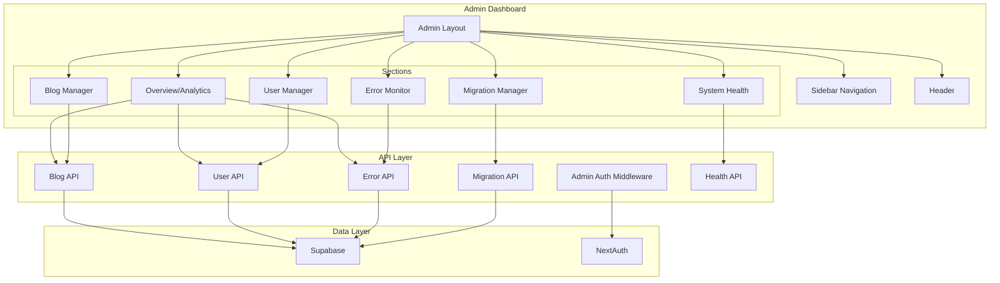

# Design Document: Admin Dashboard

## Overview

The Admin Dashboard is a comprehensive administrative interface for the Micro-Tools platform. It provides a unified, professional interface for managing all aspects of the platform including users, blog articles, errors, migrations, and system health. The dashboard follows a modular architecture with a sidebar navigation pattern, supporting both Arabic and English languages with proper RTL/LTR layouts.

## Architecture



## Components and Interfaces

### 1. Admin Layout Component

```typescript
// src/app/[locale]/admin/layout.tsx
interface AdminLayoutProps {
  children: React.ReactNode;
  params: { locale: string };
}

// Provides the main admin layout with sidebar and header
// Handles admin authentication check
// Supports RTL/LTR based on locale
```

### 2. Sidebar Navigation Component

```typescript
// src/components/admin/admin-sidebar.tsx
interface AdminSidebarProps {
  activeSection: AdminSection;
  onSectionChange: (section: AdminSection) => void;
  locale: string;
}

type AdminSection = 
  | 'overview'
  | 'blog'
  | 'users'
  | 'errors'
  | 'migrations'
  | 'health'
  | 'keys';

interface NavItem {
  id: AdminSection;
  icon: LucideIcon;
  labelKey: string; // Translation key
  href: string;
}
```

### 3. Admin Header Component

```typescript
// src/components/admin/admin-header.tsx
interface AdminHeaderProps {
  title: string;
  user: {
    email: string;
    role: string;
  };
  locale: string;
}
```

### 4. Overview/Analytics Component

```typescript
// src/components/admin/analytics-overview.tsx
interface AnalyticsOverviewProps {
  locale: string;
}

interface DashboardMetrics {
  totalTools: number;
  totalCalculations: number;
  totalUsers: number;
  totalArticles: number;
  calculationsToday: number;
  newUsersThisMonth: number;
}

interface ChartData {
  date: string;
  calculations: number;
}

interface TopTool {
  slug: string;
  name: string;
  usageCount: number;
}

interface RecentActivity {
  id: string;
  type: 'calculation' | 'user_signup' | 'article_created' | 'error';
  description: string;
  timestamp: string;
}
```

### 5. Blog Manager Component

```typescript
// src/components/admin/blog-manager.tsx
interface BlogManagerProps {
  locale: string;
}

interface ArticleListItem {
  id: string;
  title: string;
  slug: string;
  status: 'published' | 'draft';
  category: string;
  createdAt: string;
  updatedAt: string;
}

interface ArticleFilters {
  status?: 'published' | 'draft' | 'all';
  category?: string;
  search?: string;
}
```

### 6. User Manager Component

```typescript
// src/components/admin/user-manager.tsx
interface UserManagerProps {
  locale: string;
}

interface UserListItem {
  id: string;
  email: string;
  emailConfirmed: boolean;
  createdAt: string;
  lastSignIn: string | null;
  calculationCount: number;
}

interface UserStats {
  totalUsers: number;
  activeUsers: number;
  newUsersThisMonth: number;
  unconfirmedUsers: number;
}
```

### 7. Error Monitor Component

```typescript
// src/components/admin/error-monitor.tsx
interface ErrorMonitorProps {
  locale: string;
}

interface ErrorMetrics {
  totalErrors: number;
  criticalErrors: number;
  errorRate: number;
  resolvedToday: number;
}

interface ErrorItem {
  id: string;
  severity: 'critical' | 'error' | 'warning';
  message: string;
  stackTrace?: string;
  timestamp: string;
  acknowledged: boolean;
  resolved: boolean;
}

interface ErrorFilters {
  severity?: 'critical' | 'error' | 'warning' | 'all';
  timeRange?: '1h' | '6h' | '24h' | '7d' | '30d';
  status?: 'all' | 'unresolved' | 'resolved';
}
```

### 8. Migration Manager Component

```typescript
// src/components/admin/migration-manager.tsx
interface MigrationManagerProps {
  locale: string;
}

interface MigrationItem {
  name: string;
  status: 'executed' | 'pending' | 'failed' | 'rolled_back';
  executedAt?: string;
  executionTimeMs?: number;
  batchId?: string;
  errorMessage?: string;
}

interface MigrationStats {
  total: number;
  executed: number;
  pending: number;
  failed: number;
}
```

### 9. System Health Component

```typescript
// src/components/admin/system-health.tsx
interface SystemHealthProps {
  locale: string;
}

interface HealthStatus {
  database: ServiceStatus;
  supabase: ServiceStatus;
  api: ServiceStatus;
  memory?: ResourceUsage;
  cpu?: ResourceUsage;
}

interface ServiceStatus {
  status: 'healthy' | 'degraded' | 'down';
  responseTimeMs?: number;
  lastChecked: string;
  message?: string;
}

interface ResourceUsage {
  used: number;
  total: number;
  percentage: number;
}
```

### 10. Admin Auth Hook

```typescript
// src/lib/admin/use-admin-auth.ts
interface UseAdminAuthReturn {
  isAdmin: boolean;
  isLoading: boolean;
  user: AdminUser | null;
  error: string | null;
}

interface AdminUser {
  id: string;
  email: string;
  role: 'admin';
}

function useAdminAuth(): UseAdminAuthReturn;
```

### 11. Keys Manager Component

```typescript
// src/components/admin/keys-manager.tsx
interface KeysManagerProps {
  locale: string;
}

interface ApiKeyConfig {
  id: string;
  name: string;
  key: string; // Translation key for display name
  description: string;
  value: string | null; // Masked value for display
  isSet: boolean;
  isValid: boolean | null;
  lastUpdated: string | null;
  testable: boolean; // Whether the key can be tested
  category: 'ai' | 'database' | 'auth' | 'other';
}

interface KeyValidationResult {
  isValid: boolean;
  message: string;
  details?: Record<string, unknown>;
}

// Supported API Keys
const API_KEYS = [
  { id: 'openrouter', name: 'OpenRouter API Key', category: 'ai', testable: true },
  { id: 'supabase_url', name: 'Supabase URL', category: 'database', testable: true },
  { id: 'supabase_anon', name: 'Supabase Anon Key', category: 'database', testable: true },
  { id: 'supabase_service', name: 'Supabase Service Role Key', category: 'database', testable: false },
  { id: 'nextauth_secret', name: 'NextAuth Secret', category: 'auth', testable: false },
  { id: 'admin_emails', name: 'Admin Emails', category: 'auth', testable: false },
] as const;
```

## Data Models

### Admin Session

```typescript
interface AdminSession {
  user: {
    id: string;
    email: string;
    name?: string;
  };
  isAdmin: boolean;
  expires: string;
}
```

### API Response Types

```typescript
interface AdminApiResponse<T> {
  success: boolean;
  data?: T;
  error?: string;
  code?: string;
}

interface PaginatedResponse<T> {
  items: T[];
  total: number;
  page: number;
  pageSize: number;
  totalPages: number;
}
```

## Correctness Properties

*A property is a characteristic or behavior that should hold true across all valid executions of a system-essentially, a formal statement about what the system should do. Properties serve as the bridge between human-readable specifications and machine-verifiable correctness guarantees.*

### Property 1: Admin Authorization Verification

*For any* user session and admin email list, the admin dashboard SHALL grant access if and only if the user is authenticated AND the user's email is in the ADMIN_EMAILS list.

**Validates: Requirements 1.1, 1.2**

### Property 2: Navigation State Consistency

*For any* navigation action to a section, the sidebar SHALL highlight exactly one section that matches the current route, and the header SHALL display the corresponding section title.

**Validates: Requirements 2.2, 2.5**

### Property 3: Locale Direction Consistency

*For any* locale setting (ar or en), the admin dashboard layout SHALL apply the correct text direction (RTL for Arabic, LTR for English) consistently across all components.

**Validates: Requirements 2.3**

### Property 4: Article List Display Completeness

*For any* list of blog articles, the Blog Manager SHALL display all required fields (title, status, date, category) for each article in the list.

**Validates: Requirements 3.1**

### Property 5: Article Filtering Correctness

*For any* filter criteria (status, category) and search query, the Blog Manager SHALL return only articles that match ALL specified criteria.

**Validates: Requirements 3.5, 3.6**

### Property 6: User List Pagination Correctness

*For any* page number and page size, the User Manager SHALL return the correct subset of users, and pagination controls SHALL reflect the total count accurately.

**Validates: Requirements 4.1**

### Property 7: User Search Accuracy

*For any* search query, the User Manager SHALL return only users whose email contains the search query (case-insensitive).

**Validates: Requirements 4.2**

### Property 8: User Statistics Calculation

*For any* set of users, the User Manager SHALL calculate statistics (total, active, new this month) that accurately reflect the user data.

**Validates: Requirements 4.5**

### Property 9: Error Metrics Accuracy

*For any* set of errors, the Error Monitor SHALL calculate metrics (total, critical, error rate) that accurately reflect the error data.

**Validates: Requirements 5.1**

### Property 10: Error Filtering Correctness

*For any* filter criteria (severity, time range, status), the Error Monitor SHALL return only errors that match ALL specified criteria.

**Validates: Requirements 5.4**

### Property 11: Migration Statistics Accuracy

*For any* set of migrations, the Migration Manager SHALL calculate statistics (total, executed, pending, failed) that accurately reflect the migration data.

**Validates: Requirements 6.1, 6.2**

### Property 12: Analytics Metrics Calculation

*For any* date range, the Analytics Overview SHALL calculate metrics that accurately reflect the data within that range, including correct aggregation by day for charts.

**Validates: Requirements 7.1, 7.2, 7.5**

### Property 13: Top Tools Ranking

*For any* set of calculation records, the Analytics Overview SHALL return the top 5 tools sorted by usage count in descending order.

**Validates: Requirements 7.3**

### Property 14: Recent Activity Ordering

*For any* set of activities, the Analytics Overview SHALL return the 10 most recent activities sorted by timestamp in descending order.

**Validates: Requirements 7.4**

### Property 15: API Authorization Enforcement

*For any* API request to admin endpoints, the API SHALL return 403 Forbidden if the requesting user is not an admin, and SHALL process the request only if the user is an admin.

**Validates: Requirements 10.1, 10.2**

### Property 16: Admin Action Logging

*For any* administrative action performed via the API, the system SHALL create a log entry containing the user ID, action type, and timestamp.

**Validates: Requirements 11.3**

### Property 17: API Key Masking

*For any* API key displayed in the Keys Manager, the value SHALL be masked (showing only first 4 and last 4 characters) to prevent exposure.

**Validates: Requirements 10.1**

### Property 18: API Key Validation

*For any* API key that supports testing, the Keys Manager SHALL correctly report whether the key is valid based on the test result.

**Validates: Requirements 10.2, 10.5**

## Error Handling

### Authentication Errors

| Error | Handling |
|-------|----------|
| Session expired | Redirect to login with return URL |
| Not authenticated | Redirect to login page |
| Not authorized (non-admin) | Display unauthorized message, redirect to home |

### API Errors

| Error | Handling |
|-------|----------|
| 401 Unauthorized | Redirect to login |
| 403 Forbidden | Display access denied message |
| 404 Not Found | Display not found message |
| 500 Server Error | Display error message with retry option |
| Network Error | Display offline message with retry option |

### Data Loading Errors

| Error | Handling |
|-------|----------|
| Failed to load data | Display error message with retry button |
| Partial data failure | Display available data with warning |
| Timeout | Display timeout message with retry option |

## Testing Strategy

### Unit Tests

Unit tests will verify specific examples and edge cases:

1. **Admin Auth Hook Tests**
   - Test with valid admin session
   - Test with non-admin session
   - Test with expired session
   - Test with no session

2. **Component Rendering Tests**
   - Test sidebar renders all navigation items
   - Test header displays correct section title
   - Test empty states for lists
   - Test loading states

3. **Utility Function Tests**
   - Test date formatting for both locales
   - Test number formatting
   - Test pagination calculations

### Property-Based Tests

Property-based tests will use **fast-check** library with minimum 100 iterations per test.

1. **Authorization Property Test**
   - Generate random user sessions and admin email lists
   - Verify access is granted/denied correctly
   - Tag: **Feature: admin-dashboard, Property 1: Admin Authorization Verification**

2. **Filtering Property Tests**
   - Generate random article/error/user lists and filter criteria
   - Verify filtered results match all criteria
   - Tag: **Feature: admin-dashboard, Property 5: Article Filtering Correctness**
   - Tag: **Feature: admin-dashboard, Property 7: User Search Accuracy**
   - Tag: **Feature: admin-dashboard, Property 10: Error Filtering Correctness**

3. **Statistics Calculation Property Tests**
   - Generate random data sets
   - Verify calculated statistics match expected values
   - Tag: **Feature: admin-dashboard, Property 8: User Statistics Calculation**
   - Tag: **Feature: admin-dashboard, Property 9: Error Metrics Accuracy**
   - Tag: **Feature: admin-dashboard, Property 11: Migration Statistics Accuracy**

4. **Pagination Property Tests**
   - Generate random lists and page parameters
   - Verify correct subset is returned
   - Tag: **Feature: admin-dashboard, Property 6: User List Pagination Correctness**

5. **Sorting Property Tests**
   - Generate random activity/tool lists
   - Verify correct ordering
   - Tag: **Feature: admin-dashboard, Property 13: Top Tools Ranking**
   - Tag: **Feature: admin-dashboard, Property 14: Recent Activity Ordering**

### Integration Tests

1. **Admin Route Protection**
   - Test admin routes redirect unauthenticated users
   - Test admin routes reject non-admin users
   - Test admin routes allow admin users

2. **API Endpoint Tests**
   - Test all admin API endpoints with valid/invalid auth
   - Test CRUD operations for blog articles
   - Test user management operations

### Test Configuration

```typescript
// jest.config.js additions for admin tests
{
  testMatch: [
    '**/src/components/admin/**/*.test.ts',
    '**/src/lib/admin/**/*.test.ts',
    '**/src/app/api/admin/**/*.test.ts'
  ]
}
```
