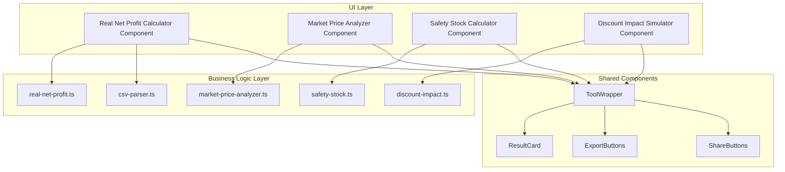

# Design Document: Advanced Merchant Calculators

## Overview

This design document outlines the architecture and implementation details for a suite of advanced financial calculators targeting e-commerce merchants. The tools are designed to integrate seamlessly with the existing Micro-Tools Next.js application, following established patterns for components, business logic separation, and internationalization.

The suite includes four main calculators:
1. **Real Net Profit Calculator** - Calculates true profit after ad spend, shipping, and returns
2. **Market Price Positioning Analyzer** - Analyzes competitive pricing position
3. **Safety Stock Calculator** - Calculates reorder points and safety stock levels
4. **Discount Impact Simulator** - Simulates the effect of discounts on profitability

## Architecture



## Components and Interfaces

### 1. Real Net Profit Calculator

#### Input Interface
```typescript
interface RealNetProfitInput {
  revenue: number;
  productCost: number;
  adSpend: number;
  shippingCost: number;
  returnRate: number; // percentage (0-100)
  otherCosts?: number;
}

interface CSVAdData {
  platform: 'facebook' | 'tiktok' | 'google' | 'other';
  spend: number;
  impressions?: number;
  clicks?: number;
  conversions?: number;
}
```

#### Output Interface
```typescript
interface RealNetProfitResult {
  netProfit: number;
  netProfitMargin: number; // percentage
  returnLosses: number;
  totalCosts: number;
  costBreakdown: {
    productCost: { amount: number; percentage: number };
    adSpend: { amount: number; percentage: number };
    shippingCost: { amount: number; percentage: number };
    returnLosses: { amount: number; percentage: number };
    otherCosts: { amount: number; percentage: number };
  };
  isProfitable: boolean;
  largestCostContributor: string;
}
```

#### Component Structure
```tsx
// src/components/tools/real-net-profit-calculator.tsx
'use client';

import { useState } from 'react';
import { useTranslations } from 'next-intl';
import { ToolWrapper } from './tool-wrapper';
import { ResultCard } from './shared/result-card';
import { calculateRealNetProfit, parseAdCSV } from '@/lib/calculators/real-net-profit';

export function RealNetProfitCalculator() {
  // State for inputs and results
  // CSV file upload handler
  // Calculate button handler
  // Results display with cost breakdown
}
```

### 2. Market Price Positioning Analyzer

#### Input Interface
```typescript
interface MarketPriceInput {
  myPrice: number;
  competitorPrices: number[]; // minimum 3 prices
  productCategory?: string;
}
```

#### Output Interface
```typescript
interface MarketPriceResult {
  pricePosition: number; // 0-100 percentage
  positionCategory: 'budget' | 'value' | 'premium' | 'luxury';
  marketAverage: number;
  minPrice: number;
  maxPrice: number;
  priceRange: number;
  recommendation: {
    action: 'increase' | 'decrease' | 'maintain';
    suggestedPrice?: number;
    reasoning: string;
  };
  competitorAnalysis: {
    belowMe: number;
    aboveMe: number;
    percentile: number;
  };
}
```

### 3. Safety Stock Calculator

#### Input Interface
```typescript
interface SafetyStockInput {
  averageDailySales: number;
  leadTimeDays: number;
  safetyDays: number; // default 7
  currentStock?: number;
  salesVariability?: number; // standard deviation of daily sales
}
```

#### Output Interface
```typescript
interface SafetyStockResult {
  safetyStock: number;
  reorderPoint: number;
  daysUntilStockout?: number;
  needsReorder: boolean;
  urgencyLevel: 'normal' | 'warning' | 'critical';
  projectedStockoutDate?: Date;
  recommendedOrderQuantity: number;
}
```

### 4. Discount Impact Simulator

#### Input Interface
```typescript
interface DiscountImpactInput {
  originalPrice: number;
  productCost: number;
  discountPercentage: number;
  currentMonthlySales: number;
}
```

#### Output Interface
```typescript
interface DiscountImpactResult {
  originalMargin: number; // percentage
  discountedPrice: number;
  discountedMargin: number; // percentage
  marginReduction: number; // percentage points
  breakEvenUnits: number;
  salesIncreaseNeeded: number; // percentage
  profitComparison: {
    salesVolume: number;
    originalProfit: number;
    discountedProfit: number;
    difference: number;
  }[];
  isViable: boolean;
  warning?: string;
}
```

## Data Models

### CSV Parser Data Model
```typescript
interface ParsedCSVResult {
  success: boolean;
  data?: CSVAdData[];
  totalSpend?: number;
  error?: string;
  rowCount?: number;
  platform?: string;
}

// Supported CSV formats
const SUPPORTED_FORMATS = {
  facebook: ['Campaign name', 'Amount spent (SAR)', 'Impressions', 'Link clicks'],
  tiktok: ['Campaign', 'Cost', 'Impressions', 'Clicks'],
  google: ['Campaign', 'Cost', 'Impressions', 'Clicks'],
};
```

### Calculation History (Optional - for logged-in users)
```typescript
interface CalculationRecord {
  id: string;
  toolType: 'real-net-profit' | 'market-price' | 'safety-stock' | 'discount-impact';
  inputs: Record<string, unknown>;
  results: Record<string, unknown>;
  createdAt: Date;
  userId?: string;
}
```


## Correctness Properties

*A property is a characteristic or behavior that should hold true across all valid executions of a system—essentially, a formal statement about what the system should do. Properties serve as the bridge between human-readable specifications and machine-verifiable correctness guarantees.*

### Property 1: CSV Parsing Extracts Correct Ad Spend Totals

*For any* valid CSV file containing ad spend data with numeric spend values, parsing the file SHALL return a total spend equal to the sum of all individual spend values in the file.

**Validates: Requirements 1.1**

### Property 2: Net Profit Calculation Correctness

*For any* valid input with revenue > 0, product cost ≥ 0, ad spend ≥ 0, shipping cost ≥ 0, and return rate between 0-100:
- Net Profit SHALL equal: Revenue - (Product Cost + Ad Spend + Shipping Cost + (Revenue × Return Rate / 100))
- Each cost component percentage SHALL equal: (Component / Revenue) × 100
- All percentages SHALL sum to (Total Costs / Revenue) × 100
- When Net Profit < 0, the largest cost contributor SHALL be correctly identified

**Validates: Requirements 1.3, 1.5, 1.6, 1.7**

### Property 3: Invalid CSV Returns Appropriate Errors

*For any* CSV file that does not conform to supported formats (missing required columns, non-numeric spend values, or malformed structure), the parser SHALL return success=false with a descriptive error message.

**Validates: Requirements 1.4, 6.4**

### Property 4: Price Position Formula Correctness

*For any* set of prices where myPrice and at least 3 competitor prices are provided, and max price ≠ min price:
- Price Position SHALL equal: ((myPrice - minPrice) / (maxPrice - minPrice)) × 100
- Price Position SHALL be between 0 and 100 when myPrice is within the competitor range

**Validates: Requirements 2.1, 2.2**

### Property 5: Price Position Categorization

*For any* calculated price position value:
- Position 0-25 SHALL map to 'budget'
- Position 25-50 SHALL map to 'value'
- Position 50-75 SHALL map to 'premium'
- Position 75-100 SHALL map to 'luxury'

**Validates: Requirements 2.3**

### Property 6: Price Recommendations Based on Position

*For any* price analysis result:
- When myPrice < market average, recommendation.action SHALL be 'increase' or reasoning SHALL mention price increase opportunity
- When myPrice > market average, the result SHALL include a warning about potential sales volume impact

**Validates: Requirements 2.4, 2.5, 2.6**

### Property 7: Reorder Point Formula Correctness

*For any* valid input with averageDailySales > 0, leadTimeDays > 0, and safetyStock ≥ 0:
- Reorder Point SHALL equal: (averageDailySales × leadTimeDays) + safetyStock

**Validates: Requirements 3.1, 3.2**

### Property 8: Safety Stock Formula Correctness

*For any* valid input with averageDailySales > 0 and safetyDays > 0:
- Safety Stock SHALL equal: averageDailySales × safetyDays

**Validates: Requirements 3.3**

### Property 9: Stock Urgency Determination

*For any* valid input with currentStock provided:
- needsReorder SHALL be true when currentStock ≤ reorderPoint
- daysUntilStockout SHALL equal: currentStock / averageDailySales
- urgencyLevel SHALL be 'critical' when daysUntilStockout < leadTimeDays
- urgencyLevel SHALL be 'warning' when daysUntilStockout < leadTimeDays + safetyDays
- urgencyLevel SHALL be 'normal' otherwise

**Validates: Requirements 3.5, 3.6, 3.7**

### Property 10: Margin Calculations Correctness

*For any* valid input with originalPrice > 0, productCost ≥ 0, and discountPercentage between 0-100:
- Original Margin SHALL equal: ((originalPrice - productCost) / originalPrice) × 100
- Discounted Price SHALL equal: originalPrice × (1 - discountPercentage / 100)
- Discounted Margin SHALL equal: ((discountedPrice - productCost) / discountedPrice) × 100

**Validates: Requirements 4.1, 4.2, 4.3**

### Property 11: Break-Even and Sales Increase Calculations

*For any* valid input where discountedMargin > 0:
- Break Even Units SHALL equal: currentMonthlySales × (originalMargin / discountedMargin)
- Sales Increase Needed SHALL equal: ((breakEvenUnits / currentMonthlySales) - 1) × 100

**Validates: Requirements 4.4, 4.5**

### Property 12: Profit Comparison Table Correctness

*For any* profit comparison entry at a given sales volume:
- Original Profit SHALL equal: salesVolume × originalPrice × (originalMargin / 100)
- Discounted Profit SHALL equal: salesVolume × discountedPrice × (discountedMargin / 100)
- Difference SHALL equal: discountedProfit - originalProfit

**Validates: Requirements 4.6**

### Property 13: Loss Warning When Discount Exceeds Margin

*For any* input where discountPercentage ≥ originalMargin (meaning discountedMargin ≤ 0):
- isViable SHALL be false
- warning SHALL indicate that each sale results in a loss

**Validates: Requirements 4.7**

### Property 14: Input Validation for Invalid Values

*For any* input containing:
- Negative values for costs, prices, or quantities: validation SHALL fail with appropriate error
- Percentage values > 100 for return rate or discount: validation SHALL return a warning

**Validates: Requirements 6.1, 6.2**

## Error Handling

### Input Validation Errors

| Error Type | Condition | User Message (EN) | User Message (AR) |
|------------|-----------|-------------------|-------------------|
| NEGATIVE_VALUE | Any cost/price < 0 | "Value cannot be negative" | "القيمة لا يمكن أن تكون سالبة" |
| INVALID_PERCENTAGE | Percentage > 100 | "Percentage cannot exceed 100%" | "النسبة لا يمكن أن تتجاوز 100%" |
| MISSING_REQUIRED | Required field empty | "This field is required" | "هذا الحقل مطلوب" |
| INSUFFICIENT_DATA | Less than 3 competitor prices | "Please enter at least 3 competitor prices" | "الرجاء إدخال 3 أسعار منافسين على الأقل" |

### CSV Parsing Errors

| Error Type | Condition | User Message |
|------------|-----------|--------------|
| INVALID_FORMAT | Unrecognized CSV structure | "CSV format not recognized. Please use Facebook, TikTok, or Google Ads export format." |
| MISSING_COLUMNS | Required columns not found | "Missing required columns: {columns}" |
| INVALID_DATA | Non-numeric spend values | "Invalid spend value in row {row}" |
| EMPTY_FILE | No data rows | "The uploaded file contains no data" |

### Calculation Errors

| Error Type | Condition | Handling |
|------------|-----------|----------|
| DIVISION_BY_ZERO | Revenue = 0 or Daily Sales = 0 | Return error, prevent calculation |
| NEGATIVE_MARGIN | Cost > Price | Allow calculation, show warning |
| INFINITE_BREAK_EVEN | Discounted margin ≤ 0 | Show "Not viable" instead of number |

## Testing Strategy

### Property-Based Testing

We will use **fast-check** library for property-based testing, as it's already configured in the project.

Each correctness property will be implemented as a property-based test with minimum 100 iterations.

#### Test File Structure
```
src/lib/calculators/
├── real-net-profit.ts
├── real-net-profit.test.ts          # Unit + Property tests
├── market-price-analyzer.ts
├── market-price-analyzer.test.ts    # Unit + Property tests
├── safety-stock.ts
├── safety-stock.test.ts             # Unit + Property tests
├── discount-impact.ts
├── discount-impact.test.ts          # Unit + Property tests
├── csv-parser.ts
├── csv-parser.test.ts               # Unit + Property tests
└── input-validation.ts
    input-validation.test.ts         # Unit + Property tests
```

#### Property Test Configuration
```typescript
import * as fc from 'fast-check';

// Configure minimum 100 iterations
const testConfig = { numRuns: 100 };

// Example property test structure
describe('Real Net Profit Calculator', () => {
  // Feature: advanced-merchant-calculators, Property 2: Net Profit Calculation Correctness
  it('should correctly calculate net profit for all valid inputs', () => {
    fc.assert(
      fc.property(
        fc.record({
          revenue: fc.float({ min: 0.01, max: 1000000 }),
          productCost: fc.float({ min: 0, max: 500000 }),
          adSpend: fc.float({ min: 0, max: 500000 }),
          shippingCost: fc.float({ min: 0, max: 100000 }),
          returnRate: fc.float({ min: 0, max: 100 }),
        }),
        (input) => {
          const result = calculateRealNetProfit(input);
          const expectedReturnLosses = input.revenue * (input.returnRate / 100);
          const expectedNetProfit = input.revenue - (
            input.productCost + input.adSpend + input.shippingCost + expectedReturnLosses
          );
          return Math.abs(result.netProfit - expectedNetProfit) < 0.01;
        }
      ),
      testConfig
    );
  });
});
```

### Unit Tests

Unit tests will cover:
- Specific examples with known expected outputs
- Edge cases (zero values, boundary conditions)
- Error conditions (invalid inputs)

#### Example Unit Tests
```typescript
describe('Real Net Profit Calculator - Unit Tests', () => {
  it('should calculate correct net profit for typical e-commerce scenario', () => {
    const input = {
      revenue: 10000,
      productCost: 4000,
      adSpend: 2000,
      shippingCost: 500,
      returnRate: 5,
    };
    const result = calculateRealNetProfit(input);
    expect(result.netProfit).toBe(3000); // 10000 - 4000 - 2000 - 500 - 500
    expect(result.isProfitable).toBe(true);
  });

  it('should identify unprofitable scenario', () => {
    const input = {
      revenue: 10000,
      productCost: 6000,
      adSpend: 4000,
      shippingCost: 500,
      returnRate: 10,
    };
    const result = calculateRealNetProfit(input);
    expect(result.isProfitable).toBe(false);
    expect(result.largestCostContributor).toBe('productCost');
  });
});
```

### Test Coverage Goals

| Component | Unit Test Coverage | Property Test Coverage |
|-----------|-------------------|----------------------|
| real-net-profit.ts | 90% | Properties 1, 2, 3 |
| market-price-analyzer.ts | 90% | Properties 4, 5, 6 |
| safety-stock.ts | 90% | Properties 7, 8, 9 |
| discount-impact.ts | 90% | Properties 10, 11, 12, 13 |
| input-validation.ts | 95% | Property 14 |
| csv-parser.ts | 85% | Properties 1, 3 |
