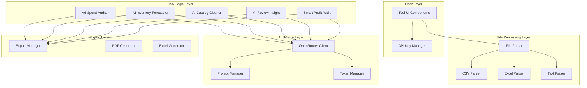

# Design Document: AI Merchant Tools

## Overview

This design document outlines the architecture and implementation details for a suite of AI-powered tools for e-commerce merchants. These tools leverage OpenRouter API to provide intelligent analysis of sales data, competitor reviews, product catalogs, inventory forecasting, and ad campaign performance.

The suite includes five AI-powered tools:
1. **Smart Profit Audit** - AI-powered sales file analysis and expense classification
2. **AI Review Insight** - Sentiment analysis and pain point extraction from reviews
3. **AI Catalog Cleaner** - AI translation and formatting of product catalogs
4. **AI Inventory Forecaster** - Predictive inventory analysis with seasonality detection
5. **Ad Spend Auditor** - Campaign performance analysis against actual profits

## Architecture



## Components and Interfaces

### 1. OpenRouter API Integration

#### API Key Manager Interface
```typescript
interface APIKeyConfig {
  apiKey: string;
  isValid: boolean;
  lastValidated: Date;
  usageThisMonth?: number;
}

interface OpenRouterClient {
  validateKey(apiKey: string): Promise<{ valid: boolean; error?: string }>;
  chat(messages: ChatMessage[], options?: ChatOptions): Promise<ChatResponse>;
  estimateTokens(text: string): number;
}

interface ChatMessage {
  role: 'system' | 'user' | 'assistant';
  content: string;
}

interface ChatOptions {
  model?: string; // default: 'anthropic/claude-3-haiku'
  maxTokens?: number;
  temperature?: number;
}

interface ChatResponse {
  content: string;
  tokensUsed: number;
  cost: number;
}
```

#### Storage Interface
```typescript
// API key stored encrypted in localStorage
const API_KEY_STORAGE_KEY = 'openrouter_api_key_encrypted';

function encryptApiKey(key: string): string;
function decryptApiKey(encrypted: string): string;
function storeApiKey(key: string): void;
function getApiKey(): string | null;
function removeApiKey(): void;
```

### 2. Smart Profit Audit

#### Input Interface
```typescript
interface SalesFileData {
  orders: OrderRecord[];
  platform: 'salla' | 'zid' | 'shopify' | 'unknown';
  dateRange: { start: Date; end: Date };
  totalRows: number;
}

interface OrderRecord {
  orderId: string;
  date: Date;
  productName: string;
  quantity: number;
  revenue: number;
  rawCosts: Record<string, number>; // unclassified costs
}
```

#### Output Interface
```typescript
interface SmartProfitResult {
  summary: {
    totalRevenue: number;
    totalCosts: number;
    netProfit: number;
    profitMargin: number;
  };
  costBreakdown: {
    paymentGatewayFees: number;
    shippingCosts: number;
    taxes: number;
    refunds: number;
    otherCosts: number;
  };
  orderAnalysis: OrderProfitAnalysis[];
  losingProducts: ProductLossAnalysis[];
  aiRecommendations: string[];
}

interface OrderProfitAnalysis {
  orderId: string;
  revenue: number;
  classifiedCosts: {
    category: string;
    amount: number;
  }[];
  netProfit: number;
  isProfitable: boolean;
}

interface ProductLossAnalysis {
  productName: string;
  totalOrders: number;
  totalLoss: number;
  lossReason: 'shipping' | 'gateway_fees' | 'refunds' | 'other';
  recommendation: string;
}
```

#### AI Prompt Template
```typescript
const PROFIT_AUDIT_SYSTEM_PROMPT = `
أنت محلل مالي متخصص في التجارة الإلكترونية. مهمتك تصنيف المصاريف في ملفات المبيعات.

صنف كل مصروف إلى:
- payment_gateway: رسوم بوابة الدفع (مدى، فيزا، أبل باي، تابي)
- shipping: تكاليف الشحن (أرامكس، سمسا، DHL)
- tax: الضرائب (VAT، ضريبة القيمة المضافة)
- refund: المرتجعات والاستردادات
- other: مصاريف أخرى

أعد النتيجة بصيغة JSON.
`;
```

### 3. AI Review Insight

#### Input Interface
```typescript
interface ReviewsInput {
  reviews: ReviewRecord[];
  language: 'ar' | 'en' | 'mixed';
  source?: string; // amazon, instagram, etc.
}

interface ReviewRecord {
  id: string;
  text: string;
  rating?: number;
  date?: Date;
}
```

#### Output Interface
```typescript
interface ReviewInsightResult {
  sentimentDistribution: {
    positive: number;
    negative: number;
    neutral: number;
  };
  painPoints: PainPoint[];
  praisedFeatures: PraisedFeature[];
  productImprovements: string[];
  competitorWeaknesses: string[];
  marketOpportunities: string[];
}

interface PainPoint {
  issue: string;
  frequency: number;
  severity: 'high' | 'medium' | 'low';
  exampleReviews: string[];
}

interface PraisedFeature {
  feature: string;
  frequency: number;
  exampleReviews: string[];
}
```

### 4. AI Catalog Cleaner

#### Input Interface
```typescript
interface CatalogInput {
  products: ProductRecord[];
  sourceLanguage: 'en' | 'ar' | 'mixed';
  targetLanguage: 'ar';
}

interface ProductRecord {
  id: string;
  title: string;
  description: string;
  category?: string;
  price?: number;
  sku?: string;
}
```

#### Output Interface
```typescript
interface CatalogCleanerResult {
  cleanedProducts: CleanedProduct[];
  processingStats: {
    totalProducts: number;
    translated: number;
    cleaned: number;
    keywordsGenerated: number;
  };
}

interface CleanedProduct {
  id: string;
  originalTitle: string;
  cleanedTitle: string;
  originalDescription: string;
  cleanedDescription: string;
  seoKeywords: string[];
  changes: string[]; // list of changes made
}
```

### 5. AI Inventory Forecaster

#### Input Interface
```typescript
interface SalesHistoryInput {
  salesData: DailySalesRecord[];
  products: ProductInventory[];
  leadTimeDays?: number;
}

interface DailySalesRecord {
  date: Date;
  productId: string;
  quantitySold: number;
}

interface ProductInventory {
  productId: string;
  productName: string;
  currentStock: number;
  reorderCost?: number;
}
```

#### Output Interface
```typescript
interface InventoryForecastResult {
  predictions: ProductPrediction[];
  seasonalityPatterns: SeasonalPattern[];
  urgentAlerts: UrgentAlert[];
  recommendations: string[];
}

interface ProductPrediction {
  productId: string;
  productName: string;
  currentStock: number;
  averageDailySales: number;
  predictedStockoutDate: Date;
  daysUntilStockout: number;
  recommendedOrderQuantity: number;
  recommendedOrderDate: Date;
}

interface SeasonalPattern {
  period: string; // 'ramadan', 'eid', 'summer', etc.
  expectedDemandIncrease: number; // percentage
  affectedProducts: string[];
}

interface UrgentAlert {
  productId: string;
  productName: string;
  message: string;
  severity: 'critical' | 'warning';
}
```

### 6. Ad Spend Auditor

#### Input Interface
```typescript
interface AdAuditInput {
  adReports: AdCampaignReport[];
  salesData: SalesRecord[];
  productCosts: ProductCostRecord[];
}

interface AdCampaignReport {
  campaignId: string;
  campaignName: string;
  platform: 'facebook' | 'tiktok' | 'google' | 'snapchat';
  spend: number;
  impressions: number;
  clicks: number;
  conversions: number;
  dateRange: { start: Date; end: Date };
}

interface SalesRecord {
  orderId: string;
  date: Date;
  revenue: number;
  productCost: number;
  source?: string; // campaign attribution
}

interface ProductCostRecord {
  productId: string;
  cost: number;
  profitMargin: number;
}
```

#### Output Interface
```typescript
interface AdAuditResult {
  campaignPerformance: CampaignAnalysis[];
  summary: {
    totalAdSpend: number;
    totalRevenue: number;
    totalProfit: number;
    overallROI: number;
    wastedBudget: number;
  };
  profitableCampaigns: string[];
  unprofitableCampaigns: string[];
  recommendations: CampaignRecommendation[];
}

interface CampaignAnalysis {
  campaignId: string;
  campaignName: string;
  spend: number;
  revenue: number;
  profit: number;
  roi: number;
  cpa: number; // cost per acquisition
  isProfitable: boolean;
  profitPerConversion: number;
}

interface CampaignRecommendation {
  campaignId: string;
  action: 'stop' | 'reduce' | 'maintain' | 'increase';
  reason: string;
  potentialSavings?: number;
}
```

## Data Models

### File Parser Data Model
```typescript
interface ParsedFile {
  success: boolean;
  data?: Record<string, unknown>[];
  headers?: string[];
  rowCount?: number;
  fileType: 'csv' | 'xlsx' | 'txt';
  error?: string;
}

interface FileValidation {
  isValid: boolean;
  errors: string[];
  warnings: string[];
  detectedPlatform?: string;
  requiredColumns?: string[];
  missingColumns?: string[];
}
```

### Token Usage Tracking
```typescript
interface TokenUsage {
  toolName: string;
  tokensUsed: number;
  estimatedCost: number;
  timestamp: Date;
}

interface UsageSummary {
  totalTokens: number;
  totalCost: number;
  byTool: Record<string, { tokens: number; cost: number }>;
}
```


## Correctness Properties

*A property is a characteristic or behavior that should hold true across all valid executions of a system—essentially, a formal statement about what the system should do. Properties serve as the bridge between human-readable specifications and machine-verifiable correctness guarantees.*

### Property 1: API Key Encryption Round-Trip

*For any* valid API key string, encrypting the key and then decrypting it SHALL return the original key unchanged.

**Validates: Requirements 1.2**

### Property 2: Token Estimation Accuracy

*For any* text input, the estimated token count SHALL be within ±20% of the actual token count used by the API.

**Validates: Requirements 1.5**

### Property 3: File Format Validation

*For any* uploaded file:
- Valid CSV/XLSX/TXT files SHALL return success=true with parsed data
- Files exceeding 10MB SHALL return an error with size limit message
- Unrecognized formats SHALL return success=false with format error

**Validates: Requirements 7.2, 7.3**

### Property 4: Net Profit Calculation Correctness

*For any* order with revenue and classified costs:
- Net Profit SHALL equal: Revenue - Sum(all classified costs)
- If Net Profit < 0, the order SHALL be flagged as unprofitable
- The sum of cost breakdown categories SHALL equal total costs

**Validates: Requirements 2.3, 2.4**

### Property 5: Expense Classification Output Validity

*For any* AI-classified expense:
- Category SHALL be one of: 'payment_gateway', 'shipping', 'tax', 'refund', 'other'
- Amount SHALL be a non-negative number
- All expenses in input SHALL have a classification in output

**Validates: Requirements 2.2**

### Property 6: Sentiment Analysis Output Validity

*For any* review analysis result:
- Each review SHALL have sentiment in: 'positive', 'negative', 'neutral'
- Sentiment distribution percentages SHALL sum to 100%
- Pain points SHALL only reference reviews with negative sentiment
- Praised features SHALL only reference reviews with positive sentiment

**Validates: Requirements 3.2, 3.3, 3.4**

### Property 7: Catalog Cleaning Output Validity

*For any* cleaned product:
- Cleaned title SHALL not contain symbols from a predefined list (®, ™, ©, etc.)
- If source language is English, cleaned title SHALL contain Arabic characters
- SEO keywords array SHALL have at least 3 keywords
- Original data SHALL be preserved alongside cleaned data

**Validates: Requirements 4.2, 4.3, 4.4**

### Property 8: Stockout Date Calculation Correctness

*For any* product with currentStock > 0 and averageDailySales > 0:
- Days until stockout SHALL equal: currentStock / averageDailySales (rounded)
- Predicted stockout date SHALL equal: current date + days until stockout
- If days until stockout < lead time, urgency SHALL be 'critical'
- If days until stockout < lead time + safety days, urgency SHALL be 'warning'

**Validates: Requirements 5.3, 5.5**

### Property 9: ROI Calculation Correctness

*For any* campaign with spend > 0:
- ROI SHALL equal: ((revenue - spend) / spend) × 100
- CPA SHALL equal: spend / conversions (when conversions > 0)
- If CPA > product profit margin, campaign SHALL be flagged as unprofitable
- Profitable campaigns list SHALL only contain campaigns where profit > 0

**Validates: Requirements 6.2, 6.3**

### Property 10: Analysis Output Completeness

*For any* completed analysis:
- Smart Profit Audit result SHALL contain: summary, costBreakdown, orderAnalysis, recommendations
- Review Insight result SHALL contain: sentimentDistribution, painPoints, praisedFeatures, improvements
- Inventory Forecast result SHALL contain: predictions, seasonalityPatterns, urgentAlerts
- Ad Audit result SHALL contain: campaignPerformance, summary, recommendations

**Validates: Requirements 2.5, 3.6, 5.6, 6.5**

## Error Handling

### API Errors

| Error Type | Condition | User Message (AR) | User Message (EN) |
|------------|-----------|-------------------|-------------------|
| INVALID_API_KEY | API key validation fails | "مفتاح API غير صالح. تأكد من نسخه بشكل صحيح" | "Invalid API key. Please verify it was copied correctly" |
| RATE_LIMIT | Too many requests | "تم تجاوز الحد المسموح. انتظر {minutes} دقائق" | "Rate limit exceeded. Please wait {minutes} minutes" |
| INSUFFICIENT_CREDITS | No credits remaining | "رصيد OpenRouter غير كافٍ. قم بشحن حسابك" | "Insufficient OpenRouter credits. Please top up your account" |
| API_TIMEOUT | Request timeout | "انتهت مهلة الطلب. حاول مرة أخرى" | "Request timed out. Please try again" |

### File Processing Errors

| Error Type | Condition | User Message (AR) |
|------------|-----------|-------------------|
| FILE_TOO_LARGE | File > 10MB | "حجم الملف كبير جداً. الحد الأقصى 10 ميجابايت" |
| INVALID_FORMAT | Unrecognized format | "صيغة الملف غير مدعومة. استخدم CSV أو Excel" |
| MISSING_COLUMNS | Required columns missing | "أعمدة مطلوبة مفقودة: {columns}" |
| EMPTY_FILE | No data rows | "الملف فارغ أو لا يحتوي على بيانات" |
| PARSE_ERROR | Parsing failed | "فشل في قراءة الملف. تأكد من صحة التنسيق" |

### AI Processing Errors

| Error Type | Condition | Handling |
|------------|-----------|----------|
| AI_RESPONSE_INVALID | AI returns malformed JSON | Retry with simplified prompt |
| AI_RESPONSE_INCOMPLETE | Missing required fields | Request completion |
| CONTEXT_TOO_LONG | Input exceeds token limit | Split into chunks |

## Testing Strategy

### Property-Based Testing

We will use **fast-check** library for property-based testing with minimum 100 iterations per property.

#### Test File Structure
```
src/lib/ai-tools/
├── openrouter-client.ts
├── openrouter-client.test.ts      # Properties 1, 2
├── file-parser.ts
├── file-parser.test.ts            # Property 3
├── smart-profit-audit.ts
├── smart-profit-audit.test.ts     # Properties 4, 5, 10
├── review-insight.ts
├── review-insight.test.ts         # Properties 6, 10
├── catalog-cleaner.ts
├── catalog-cleaner.test.ts        # Property 7
├── inventory-forecaster.ts
├── inventory-forecaster.test.ts   # Properties 8, 10
├── ad-spend-auditor.ts
├── ad-spend-auditor.test.ts       # Properties 9, 10
└── encryption.ts
    encryption.test.ts             # Property 1
```

#### Property Test Examples

```typescript
import * as fc from 'fast-check';

// Property 1: API Key Encryption Round-Trip
describe('API Key Encryption', () => {
  it('should return original key after encrypt/decrypt cycle', () => {
    fc.assert(
      fc.property(
        fc.string({ minLength: 10, maxLength: 100 }),
        (apiKey) => {
          const encrypted = encryptApiKey(apiKey);
          const decrypted = decryptApiKey(encrypted);
          return decrypted === apiKey;
        }
      ),
      { numRuns: 100 }
    );
  });
});

// Property 4: Net Profit Calculation
describe('Net Profit Calculation', () => {
  it('should correctly calculate net profit for all valid inputs', () => {
    fc.assert(
      fc.property(
        fc.record({
          revenue: fc.float({ min: 0, max: 1000000 }),
          costs: fc.array(fc.float({ min: 0, max: 100000 }), { minLength: 1, maxLength: 10 })
        }),
        ({ revenue, costs }) => {
          const totalCosts = costs.reduce((a, b) => a + b, 0);
          const result = calculateNetProfit(revenue, costs);
          const expectedProfit = revenue - totalCosts;
          return Math.abs(result.netProfit - expectedProfit) < 0.01;
        }
      ),
      { numRuns: 100 }
    );
  });
});

// Property 8: Stockout Date Calculation
describe('Stockout Prediction', () => {
  it('should correctly calculate days until stockout', () => {
    fc.assert(
      fc.property(
        fc.record({
          currentStock: fc.integer({ min: 1, max: 10000 }),
          dailySales: fc.float({ min: 0.1, max: 1000 }),
          leadTime: fc.integer({ min: 1, max: 60 })
        }),
        ({ currentStock, dailySales, leadTime }) => {
          const result = predictStockout(currentStock, dailySales, leadTime);
          const expectedDays = Math.round(currentStock / dailySales);
          const daysMatch = result.daysUntilStockout === expectedDays;
          const urgencyCorrect = 
            (expectedDays < leadTime && result.urgency === 'critical') ||
            (expectedDays >= leadTime && result.urgency !== 'critical');
          return daysMatch && urgencyCorrect;
        }
      ),
      { numRuns: 100 }
    );
  });
});
```

### Unit Tests

Unit tests will cover:
- Specific examples with known expected outputs
- Edge cases (empty files, zero values)
- Error conditions (invalid inputs, API failures)
- AI response parsing and validation

### Test Coverage Goals

| Component | Unit Test Coverage | Property Test Coverage |
|-----------|-------------------|----------------------|
| openrouter-client.ts | 85% | Properties 1, 2 |
| file-parser.ts | 90% | Property 3 |
| smart-profit-audit.ts | 85% | Properties 4, 5, 10 |
| review-insight.ts | 85% | Properties 6, 10 |
| catalog-cleaner.ts | 85% | Property 7 |
| inventory-forecaster.ts | 85% | Properties 8, 10 |
| ad-spend-auditor.ts | 85% | Properties 9, 10 |
| encryption.ts | 95% | Property 1 |
