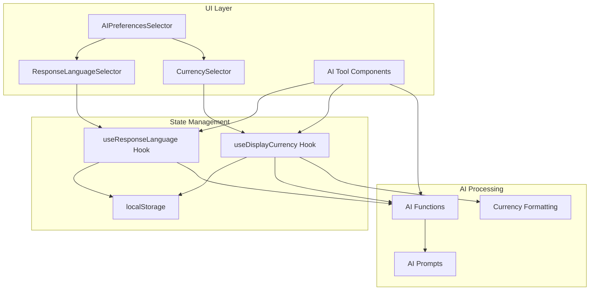

# Design Document: AI Response Language & Currency Selector

## Overview

This feature adds language and currency selector components to all AI-powered tools, enabling users to choose their preferred language for AI-generated responses and currency for financial displays. Both preferences are persisted in browser localStorage and passed to all AI processing functions.

## Architecture



## Components and Interfaces

### 1. ResponseLanguageSelector Component

Location: `src/components/tools/shared/response-language-selector.tsx`

```typescript
interface LanguageOption {
  code: string;        // e.g., 'ar', 'en', 'fr'
  name: string;        // Native name: 'العربية', 'English', 'Français'
  englishName: string; // English name for accessibility
}

interface ResponseLanguageSelectorProps {
  onChange?: (language: string) => void;
  compact?: boolean;
}

// Predefined languages
const SUPPORTED_LANGUAGES: LanguageOption[] = [
  { code: 'ar', name: 'العربية', englishName: 'Arabic' },
  { code: 'en', name: 'English', englishName: 'English' },
  { code: 'fr', name: 'Français', englishName: 'French' },
  { code: 'es', name: 'Español', englishName: 'Spanish' },
  { code: 'de', name: 'Deutsch', englishName: 'German' },
  { code: 'tr', name: 'Türkçe', englishName: 'Turkish' },
  { code: 'ur', name: 'اردو', englishName: 'Urdu' },
  { code: 'zh', name: '中文', englishName: 'Chinese' },
  { code: 'other', name: 'Other', englishName: 'Other' },
];
```

### 2. CurrencySelector Component

Location: `src/components/tools/shared/currency-selector.tsx`

```typescript
interface CurrencyOption {
  code: string;        // ISO 4217 code: 'SAR', 'USD', 'EUR'
  symbol: string;      // Symbol: 'ر.س', '$', '€'
  name: string;        // Native name
  englishName: string; // English name
}

interface CurrencySelectorProps {
  onChange?: (currency: string) => void;
  compact?: boolean;
}

// Predefined currencies (focus on Middle East + major currencies)
const SUPPORTED_CURRENCIES: CurrencyOption[] = [
  { code: 'SAR', symbol: 'ر.س', name: 'ريال سعودي', englishName: 'Saudi Riyal' },
  { code: 'USD', symbol: '$', name: 'دولار أمريكي', englishName: 'US Dollar' },
  { code: 'EUR', symbol: '€', name: 'يورو', englishName: 'Euro' },
  { code: 'GBP', symbol: '£', name: 'جنيه إسترليني', englishName: 'British Pound' },
  { code: 'AED', symbol: 'د.إ', name: 'درهم إماراتي', englishName: 'UAE Dirham' },
  { code: 'EGP', symbol: 'ج.م', name: 'جنيه مصري', englishName: 'Egyptian Pound' },
  { code: 'KWD', symbol: 'د.ك', name: 'دينار كويتي', englishName: 'Kuwaiti Dinar' },
  { code: 'QAR', symbol: 'ر.ق', name: 'ريال قطري', englishName: 'Qatari Riyal' },
  { code: 'BHD', symbol: 'د.ب', name: 'دينار بحريني', englishName: 'Bahraini Dinar' },
  { code: 'OMR', symbol: 'ر.ع', name: 'ريال عماني', englishName: 'Omani Rial' },
  { code: 'other', symbol: '?', name: 'أخرى', englishName: 'Other' },
];
```

### 3. AIPreferencesSelector Component

Location: `src/components/tools/shared/ai-preferences-selector.tsx`

Combined component that includes both selectors in a single card:

```typescript
interface AIPreferencesSelectorProps {
  onLanguageChange?: (language: string) => void;
  onCurrencyChange?: (currency: string) => void;
  showLanguage?: boolean;  // default: true
  showCurrency?: boolean;  // default: true
  compact?: boolean;
}
```

### 4. Hooks

#### useResponseLanguage Hook

```typescript
interface UseResponseLanguageReturn {
  responseLanguage: string;           // Current language code or custom text
  setResponseLanguage: (lang: string) => void;
  isCustomLanguage: boolean;          // True if using custom language
  languageDisplayName: string;        // Display name for UI
}

function useResponseLanguage(): UseResponseLanguageReturn;
```

#### useDisplayCurrency Hook

```typescript
interface UseDisplayCurrencyReturn {
  displayCurrency: string;            // Current currency code
  setDisplayCurrency: (currency: string) => void;
  isCustomCurrency: boolean;          // True if using custom currency
  currencySymbol: string;             // Symbol for display
  formatAmount: (amount: number) => string; // Format with currency
}

function useDisplayCurrency(): UseDisplayCurrencyReturn;
```

## Data Models

### localStorage Keys

```typescript
const LANGUAGE_STORAGE_KEY = 'ai-response-language';
const CURRENCY_STORAGE_KEY = 'ai-display-currency';

// Language stored value format:
// - For predefined: 'ar', 'en', 'fr', etc.
// - For custom: 'custom:Hindi'

// Currency stored value format:
// - For predefined: 'SAR', 'USD', 'EUR', etc.
// - For custom: 'custom:INR'
```

### AI Function Options Update

All AI processing functions will accept optional `responseLanguage` and `currency` parameters:

```typescript
interface AIAnalysisOptions {
  locale: string;            // UI locale (existing)
  currency: string;          // Currency for formatting
  responseLanguage?: string; // Language for AI responses
}

// Example usage in analyzeProfit:
export async function analyzeProfit(
  apiKey: string,
  salesData: SalesFileData,
  options: AIAnalysisOptions
): Promise<SmartProfitResult>;
```

### AI Prompt Language Instruction

When `responseLanguage` is provided, add this instruction to AI prompts:

```typescript
function getLanguageInstruction(responseLanguage: string): string {
  const languageNames: Record<string, string> = {
    ar: 'Arabic',
    en: 'English',
    fr: 'French',
    es: 'Spanish',
    de: 'German',
    tr: 'Turkish',
    ur: 'Urdu',
    zh: 'Chinese',
  };
  
  const langName = languageNames[responseLanguage] || responseLanguage;
  return `IMPORTANT: You MUST respond in ${langName}. All text, recommendations, and explanations should be written in ${langName}.`;
}
```

## Correctness Properties

*A property is a characteristic or behavior that should hold true across all valid executions of a system—essentially, a formal statement about what the system should do. Properties serve as the bridge between human-readable specifications and machine-verifiable correctness guarantees.*

### Property 1: Language Persistence Round-Trip

*For any* language selection (predefined or custom), if the user selects a language and the page is reloaded, the Language_Selector SHALL display the same language that was previously selected.

**Validates: Requirements 2.1, 2.2, 2.4**

### Property 2: Currency Persistence Round-Trip

*For any* currency selection (predefined or custom), if the user selects a currency and the page is reloaded, the Currency_Selector SHALL display the same currency that was previously selected.

**Validates: Requirements 7.1, 7.2, 7.4**

### Property 3: AI Prompt Language Instruction

*For any* AI processing function call, if a responseLanguage is provided, the generated AI prompt SHALL contain an instruction to respond in that language.

**Validates: Requirements 3.1, 3.2, 3.3, 3.4**

### Property 4: Currency Formatting Consistency

*For any* financial value displayed by an AI tool, if a displayCurrency is set, the formatted value SHALL use the correct currency symbol and formatting for that currency.

**Validates: Requirements 8.1, 8.2, 8.3, 8.4**

### Property 5: Hook State Consistency

*For any* call to useResponseLanguage or useDisplayCurrency hooks, the returned value SHALL match the value stored in localStorage, and calling the setter SHALL update both the hook state and localStorage.

**Validates: Requirements 5.2, 5.3**

## Error Handling

| Error Scenario | Handling Strategy |
|----------------|-------------------|
| localStorage unavailable | Fall back to session state, show warning |
| Invalid stored language | Reset to default (current locale) |
| Invalid stored currency | Reset to default (SAR for ar, USD for en) |
| Custom language/currency empty | Prevent save, show validation error |
| AI fails to respond in language | Display response as-is (best effort) |
| Unknown currency code | Use code as-is without symbol |

## Testing Strategy

### Unit Tests

1. **Component Rendering**
   - Verify language dropdown renders with all predefined languages
   - Verify currency dropdown renders with all predefined currencies
   - Verify "Other" option shows custom input field
   - Verify RTL support when locale is Arabic

2. **localStorage Integration**
   - Test save on selection for both language and currency
   - Test load on mount
   - Test default values when empty

3. **Hook Behavior**
   - Test initial state
   - Test state updates
   - Test callback invocation
   - Test formatAmount function

### Property-Based Tests

Using `fast-check` for property-based testing:

1. **Property 1 & 2: Round-Trip Persistence**
   - Generate random language/currency selections
   - Save, simulate reload, verify same value returned

2. **Property 3: AI Prompt Contains Language**
   - Generate random language codes
   - Call AI function, verify prompt contains language instruction

3. **Property 4: Currency Formatting**
   - Generate random amounts and currency codes
   - Verify formatted output contains correct symbol

4. **Property 5: Hook State Consistency**
   - Generate random preference changes
   - Verify hook state matches localStorage after each change

### Test Configuration

- Minimum 100 iterations per property test
- Use `fast-check` arbitrary generators for language/currency codes
- Mock localStorage for isolated testing
