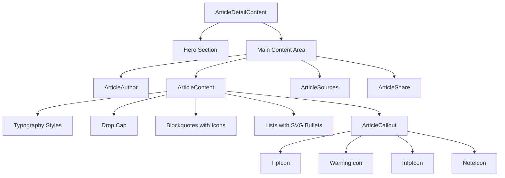
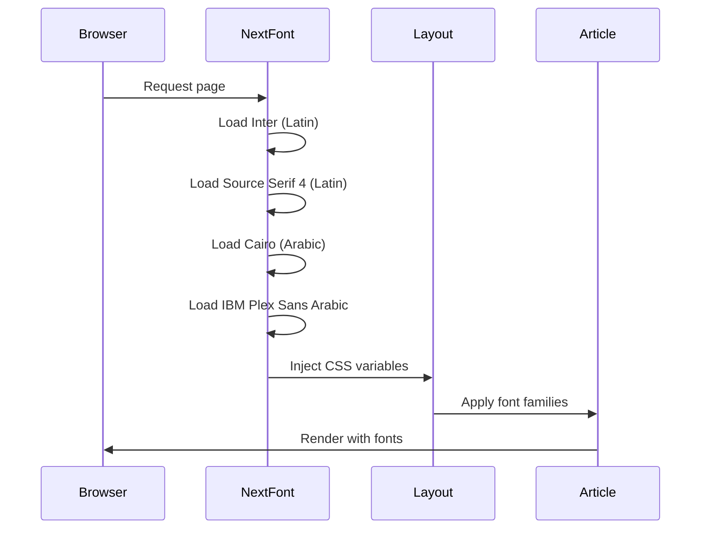
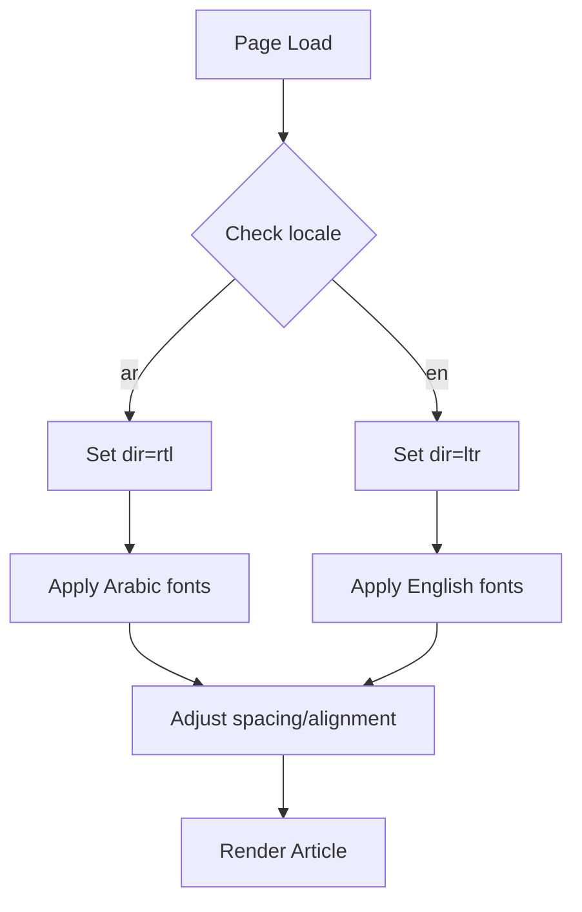

# Design Document: Blog Article Redesign

## Overview

This design document outlines the technical implementation for redesigning the blog article page in the micro-tools project. The redesign focuses on five key areas:

1. **Typography Enhancement** - Implementing a professional typography system with optimal readability
2. **Font System** - Efficient font loading with Arabic/English support using next/font
3. **Text Styling** - Enhanced styling for blockquotes, code blocks, lists, and emphasis
4. **SVG Icons System** - Replacing all emojis with consistent SVG icon components
5. **Author Section** - New component for displaying article author information

The implementation follows the existing project patterns, uses Tailwind CSS 4 with CSS variables, and ensures full RTL/LTR support for Arabic and English locales.

## Architecture

### Component Architecture

```
┌─────────────────────────────────────────────────────────────────┐
│                    ArticleDetailContent                          │
│  (src/app/[locale]/blog/[slug]/article-detail-content.tsx)      │
├─────────────────────────────────────────────────────────────────┤
│  ┌─────────────────┐  ┌──────────────────────────────────────┐  │
│  │   Hero Section  │  │           Main Content               │  │
│  │  (existing)     │  │  ┌────────────────────────────────┐  │  │
│  └─────────────────┘  │  │      ArticleAuthor (NEW)       │  │  │
│                       │  │  (author name, avatar, role)   │  │  │
│                       │  └────────────────────────────────┘  │  │
│                       │  ┌────────────────────────────────┐  │  │
│                       │  │      ArticleContent            │  │  │
│                       │  │  (enhanced typography)         │  │  │
│                       │  │  ┌──────────────────────────┐  │  │  │
│                       │  │  │   ArticleCallout (NEW)   │  │  │  │
│                       │  │  │   ArticleIcons (NEW)     │  │  │  │
│                       │  │  └──────────────────────────┘  │  │  │
│                       │  └────────────────────────────────┘  │  │
│                       └──────────────────────────────────────┘  │
└─────────────────────────────────────────────────────────────────┘
```

### File Structure

```
src/
├── app/
│   ├── layout.tsx                    # Font configuration (modify)
│   └── [locale]/
│       └── blog/
│           └── [slug]/
│               └── article-detail-content.tsx  # Layout integration (modify)
├── components/
│   └── blog/
│       ├── article-content.tsx       # Typography enhancement (modify)
│       ├── article-author.tsx        # NEW: Author section component
│       ├── article-icons.tsx         # NEW: SVG icons for articles
│       └── article-callout.tsx       # NEW: Callout boxes component
├── styles/
│   └── article-typography.css        # NEW: Article-specific typography styles
└── lib/
    └── blog/
        └── types.ts                  # Add author types (modify)
```

## Components and Interfaces

### 1. ArticleIcons Component (NEW)

```typescript
// src/components/blog/article-icons.tsx

interface IconProps {
  className?: string;
  size?: number;
  "aria-hidden"?: boolean;
}

// Quote icon for blockquotes
export function QuoteIcon({ className, size = 24, ...props }: IconProps): JSX.Element;

// Bullet icon for unordered lists
export function BulletIcon({ className, size = 8, ...props }: IconProps): JSX.Element;

// Tip/lightbulb icon for tip callouts
export function TipIcon({ className, size = 20, ...props }: IconProps): JSX.Element;

// Warning/alert icon for warning callouts
export function WarningIcon({ className, size = 20, ...props }: IconProps): JSX.Element;

// Info icon for info callouts
export function InfoIcon({ className, size = 20, ...props }: IconProps): JSX.Element;

// Note/pencil icon for note callouts
export function NoteIcon({ className, size = 20, ...props }: IconProps): JSX.Element;

// Checkmark icon for success states
export function CheckIcon({ className, size = 16, ...props }: IconProps): JSX.Element;
```

### 2. ArticleCallout Component (NEW)

```typescript
// src/components/blog/article-callout.tsx

type CalloutType = "tip" | "warning" | "info" | "note";

interface ArticleCalloutProps {
  type: CalloutType;
  title?: string;
  children: React.ReactNode;
  className?: string;
}

export function ArticleCallout({ 
  type, 
  title, 
  children, 
  className 
}: ArticleCalloutProps): JSX.Element;
```

**Styling by Type:**
- `tip`: Green/success theme with lightbulb icon
- `warning`: Amber/warning theme with alert icon
- `info`: Blue/info theme with info icon
- `note`: Gray/neutral theme with note icon

### 3. ArticleAuthor Component (NEW)

```typescript
// src/components/blog/article-author.tsx

interface Author {
  name: string;
  avatar?: string;
  role?: string;
  bio?: string;
}

interface ArticleAuthorProps {
  author?: Author;
  publishedAt: Date;
  locale: string;
  className?: string;
}

export function ArticleAuthor({ 
  author, 
  publishedAt, 
  locale, 
  className 
}: ArticleAuthorProps): JSX.Element;
```

**Default Author (when not provided):**
```typescript
const defaultAuthor: Author = {
  name: "PineCalc",
  avatar: "/images/pinecalc-avatar.svg",
  role: locale === "ar" ? "فريق باين كالك" : "PineCalc Team",
};
```

### 4. Enhanced ArticleContent Component (MODIFY)

```typescript
// src/components/blog/article-content.tsx

interface ArticleContentProps {
  content: string;
  isMarkdown?: boolean;
  locale?: string;  // NEW: for RTL/LTR support
}

export function ArticleContent({ 
  content, 
  isMarkdown = true,
  locale = "en"
}: ArticleContentProps): JSX.Element;
```

**Enhanced Features:**
- Custom CSS classes for typography
- Drop cap implementation with CSS
- Custom list bullet rendering
- Blockquote with SVG quote icon
- Callout box detection and rendering

## Data Models

### Author Type Addition

```typescript
// src/lib/blog/types.ts - Add to existing file

/**
 * Article author information
 */
export interface ArticleAuthor {
  /** Author's display name */
  name: string;
  /** URL to author's avatar image */
  avatar?: string;
  /** Author's role or title */
  role?: string;
  /** Brief author biography */
  bio?: string;
}

// Update Article interface to include author
export interface Article {
  // ... existing fields ...
  /** Article author information */
  author?: ArticleAuthor;
}
```

### Font Configuration

```typescript
// Font families to be configured in layout.tsx

// English fonts
const inter = Inter({
  variable: "--font-inter",
  subsets: ["latin"],
  display: "swap",
});

const sourceSerif = Source_Serif_4({
  variable: "--font-serif",
  subsets: ["latin"],
  display: "swap",
  weight: ["400", "600", "700"],
});

// Arabic fonts
const cairo = Cairo({
  variable: "--font-cairo",
  subsets: ["arabic", "latin"],
  display: "swap",
});

const ibmPlexSansArabic = IBM_Plex_Sans_Arabic({
  variable: "--font-arabic-body",
  subsets: ["arabic"],
  display: "swap",
  weight: ["400", "500", "600", "700"],
});
```

### CSS Custom Properties

```css
/* Article typography CSS variables */
:root {
  /* Font families */
  --font-article-heading: var(--font-serif), Georgia, "Times New Roman", serif;
  --font-article-body: var(--font-inter), system-ui, sans-serif;
  --font-article-code: "JetBrains Mono", "Fira Code", monospace;
  
  /* Font sizes (fluid) */
  --font-size-body: clamp(1.0625rem, 1rem + 0.25vw, 1.1875rem);
  --font-size-h2: clamp(1.5rem, 1.25rem + 0.75vw, 1.875rem);
  --font-size-h3: clamp(1.25rem, 1.125rem + 0.5vw, 1.5rem);
  --font-size-h4: clamp(1.125rem, 1rem + 0.25vw, 1.25rem);
  
  /* Line heights */
  --line-height-body: 1.75;
  --line-height-heading: 1.3;
  
  /* Spacing */
  --spacing-paragraph: 1.5rem;
  --spacing-heading: 2rem;
}

/* Arabic-specific overrides */
[dir="rtl"] {
  --font-article-heading: var(--font-cairo), "Noto Naskh Arabic", serif;
  --font-article-body: var(--font-arabic-body), var(--font-cairo), system-ui, sans-serif;
  --line-height-body: 1.8;
}
```

## Component Styling Details

### Drop Cap Implementation

```css
.article-content > p:first-of-type::first-letter {
  float: left;
  font-family: var(--font-article-heading);
  font-size: 3.5rem;
  font-weight: 700;
  line-height: 1;
  margin-right: 0.75rem;
  margin-top: 0.25rem;
  color: hsl(var(--primary));
}

[dir="rtl"] .article-content > p:first-of-type::first-letter {
  float: right;
  margin-right: 0;
  margin-left: 0.75rem;
}
```

### Blockquote Styling

```css
.article-content blockquote {
  position: relative;
  border-left: 4px solid hsl(var(--primary));
  background: hsl(var(--muted) / 0.5);
  padding: 1.5rem 1.5rem 1.5rem 3rem;
  margin: 2rem 0;
  border-radius: 0 0.5rem 0.5rem 0;
  font-style: normal;
  font-weight: 500;
}

.article-content blockquote::before {
  content: "";
  position: absolute;
  left: 1rem;
  top: 1rem;
  width: 24px;
  height: 24px;
  background-image: url("data:image/svg+xml,..."); /* Quote SVG */
  opacity: 0.3;
}

[dir="rtl"] .article-content blockquote {
  border-left: none;
  border-right: 4px solid hsl(var(--primary));
  padding: 1.5rem 3rem 1.5rem 1.5rem;
  border-radius: 0.5rem 0 0 0.5rem;
}

[dir="rtl"] .article-content blockquote::before {
  left: auto;
  right: 1rem;
  transform: scaleX(-1);
}
```

### List Styling

```css
.article-content ul {
  list-style: none;
  padding-left: 0;
}

.article-content ul li {
  position: relative;
  padding-left: 1.75rem;
  margin-bottom: 0.75rem;
}

.article-content ul li::before {
  content: "";
  position: absolute;
  left: 0;
  top: 0.625rem;
  width: 8px;
  height: 8px;
  background: hsl(var(--primary));
  border-radius: 50%;
}

[dir="rtl"] .article-content ul li {
  padding-left: 0;
  padding-right: 1.75rem;
}

[dir="rtl"] .article-content ul li::before {
  left: auto;
  right: 0;
}
```

### Callout Box Styling

```css
.article-callout {
  display: flex;
  gap: 1rem;
  padding: 1rem 1.25rem;
  border-radius: 0.5rem;
  margin: 1.5rem 0;
  border-left: 4px solid;
}

.article-callout--tip {
  background: hsl(142 76% 36% / 0.1);
  border-color: hsl(142 76% 36%);
}

.article-callout--warning {
  background: hsl(38 92% 50% / 0.1);
  border-color: hsl(38 92% 50%);
}

.article-callout--info {
  background: hsl(217 91% 60% / 0.1);
  border-color: hsl(217 91% 60%);
}

.article-callout--note {
  background: hsl(var(--muted) / 0.5);
  border-color: hsl(var(--muted-foreground));
}

[dir="rtl"] .article-callout {
  border-left: none;
  border-right: 4px solid;
}
```

## Mermaid Diagrams

### Component Hierarchy



### Font Loading Flow



### RTL/LTR Detection Flow




## Correctness Properties

*A property is a characteristic or behavior that should hold true across all valid executions of a system—essentially, a formal statement about what the system should do. Properties serve as the bridge between human-readable specifications and machine-verifiable correctness guarantees.*

Based on the prework analysis of acceptance criteria, the following properties have been identified for property-based testing:

### Property 1: Locale-Appropriate Font Selection

*For any* article rendered with a given locale, the computed font-family of body text elements SHALL include locale-appropriate fonts (Arabic fonts for 'ar' locale, Latin fonts for 'en' locale).

**Validates: Requirements 1.2, 1.3**

### Property 2: Heading Font Hierarchy

*For any* article content, h2 elements SHALL have larger font-size than h3 elements, and h3 elements SHALL have larger font-size than h4 elements.

**Validates: Requirements 1.8**

### Property 3: Line Height Within Range

*For any* body text element in article content, the computed line-height SHALL be between 1.6 and 1.8 (inclusive).

**Validates: Requirements 1.5**

### Property 4: No Emoji Characters

*For any* rendered article content, the HTML output SHALL NOT contain any Unicode emoji characters (ranges U+1F600-U+1F64F, U+1F300-U+1F5FF, U+1F680-U+1F6FF, U+2600-U+26FF, U+2700-U+27BF).

**Validates: Requirements 4.1**

### Property 5: Blockquote Styling

*For any* blockquote element in article content, the element SHALL have a non-transparent background color and a visible left border (or right border in RTL).

**Validates: Requirements 3.1**

### Property 6: Code Block Dark Theme

*For any* code block (pre element) in article content, the background color SHALL have a luminance value less than 0.3 (dark theme).

**Validates: Requirements 3.2**

### Property 7: Custom List Bullets

*For any* unordered list in article content, the list-style-type SHALL be 'none' and list items SHALL have custom bullet styling via ::before pseudo-element.

**Validates: Requirements 3.4**

### Property 8: SVG Icon Accessibility

*For any* decorative SVG icon in article content, the element SHALL have aria-hidden="true" attribute.

**Validates: Requirements 4.7, 9.2**

### Property 9: Callout Accessibility

*For any* callout box component, the element SHALL have an appropriate ARIA role (role="note" or role="alert" for warnings).

**Validates: Requirements 5.6, 9.3**

### Property 10: RTL/LTR Layout Support

*For any* article rendered with RTL locale, blockquotes SHALL have right border instead of left border, and list bullet positions SHALL be on the right side.

**Validates: Requirements 4.5, 5.5**

### Property 11: Author Section Content

*For any* article with author information, the author section SHALL display the author's name. *For any* article without author information, the author section SHALL display "PineCalc" as fallback.

**Validates: Requirements 6.1, 6.7**

### Property 12: Author Avatar Display

*For any* author section, there SHALL be either an img element with the author's avatar or a placeholder element.

**Validates: Requirements 6.2**

### Property 13: Dark Mode Contrast

*For any* text element in article content when dark mode is active, the contrast ratio between text color and background color SHALL meet WCAG AA standards (minimum 4.5:1 for normal text).

**Validates: Requirements 7.1, 7.2, 7.3, 7.4, 9.1**

### Property 14: Heading Hierarchy Validity

*For any* article content, headings SHALL follow proper hierarchy without skipping levels (h2 can be followed by h2 or h3, h3 can be followed by h2, h3, or h4).

**Validates: Requirements 9.4**

### Property 15: Responsive Line Length

*For any* viewport width, the article content container max-width SHALL constrain line length to approximately 65-75 characters (measured as max-width between 600px and 720px).

**Validates: Requirements 8.2**

## Error Handling

### Font Loading Failures

```typescript
// Fallback font stacks ensure graceful degradation
const fontFallbacks = {
  heading: "Georgia, 'Times New Roman', serif",
  body: "system-ui, -apple-system, sans-serif",
  arabic: "'Noto Naskh Arabic', 'Geeza Pro', serif",
  code: "Consolas, Monaco, 'Courier New', monospace",
};
```

### Missing Author Information

```typescript
// Default author when not provided
const getAuthor = (author?: ArticleAuthor, locale: string): ArticleAuthor => {
  if (author?.name) return author;
  
  return {
    name: "PineCalc",
    avatar: "/images/pinecalc-avatar.svg",
    role: locale === "ar" ? "فريق باين كالك" : "PineCalc Team",
  };
};
```

### Invalid Markdown Content

```typescript
// DOMPurify sanitization for security
const sanitizeContent = async (html: string): Promise<string> => {
  if (typeof window !== 'undefined') {
    const DOMPurify = (await import('dompurify')).default;
    return DOMPurify.sanitize(html, {
      ALLOWED_TAGS: ['p', 'h2', 'h3', 'h4', 'ul', 'ol', 'li', 'blockquote', 
                     'pre', 'code', 'em', 'strong', 'a', 'img'],
      ALLOWED_ATTR: ['href', 'src', 'alt', 'class', 'id'],
    });
  }
  return html;
};
```

### Missing SVG Icons

```typescript
// Fallback to Lucide icons if custom SVGs fail
import { Quote, Lightbulb, AlertTriangle, Info, FileText } from "lucide-react";

const iconFallbacks = {
  quote: Quote,
  tip: Lightbulb,
  warning: AlertTriangle,
  info: Info,
  note: FileText,
};
```

## Testing Strategy

### Unit Tests

Unit tests will cover specific examples and edge cases:

1. **ArticleIcons Component**
   - Each icon renders correctly with default props
   - Icons accept custom className and size props
   - Icons have correct aria-hidden attribute

2. **ArticleCallout Component**
   - Each callout type renders with correct styling
   - Callout renders children content correctly
   - Callout handles missing title gracefully

3. **ArticleAuthor Component**
   - Renders author name correctly
   - Shows default avatar when none provided
   - Displays role when provided
   - Falls back to PineCalc when no author

4. **ArticleContent Component**
   - Renders markdown content correctly
   - Applies drop cap to first paragraph
   - Handles empty content gracefully
   - Sanitizes HTML content

### Property-Based Tests

Property-based tests will use `fast-check` library (already in project) to verify universal properties:

**Configuration:**
- Minimum 100 iterations per property test
- Tag format: **Feature: blog-article-redesign, Property {number}: {property_text}**

**Test File:** `src/components/blog/__tests__/article-content.property.test.ts`

```typescript
import fc from 'fast-check';
import { render } from '@testing-library/react';

// Property 4: No Emoji Characters
describe('Feature: blog-article-redesign, Property 4: No Emoji Characters', () => {
  it('should not contain emoji characters in rendered output', () => {
    fc.assert(
      fc.property(
        fc.string(), // Generate random markdown content
        (content) => {
          const { container } = render(<ArticleContent content={content} />);
          const html = container.innerHTML;
          const emojiRegex = /[\u{1F600}-\u{1F64F}]|[\u{1F300}-\u{1F5FF}]|[\u{1F680}-\u{1F6FF}]|[\u{2600}-\u{26FF}]|[\u{2700}-\u{27BF}]/u;
          return !emojiRegex.test(html);
        }
      ),
      { numRuns: 100 }
    );
  });
});
```

### Integration Tests

Integration tests will verify component interactions:

1. **ArticleDetailContent Integration**
   - Author section appears in correct position
   - Content renders with proper typography
   - RTL/LTR switching works correctly

2. **Dark Mode Integration**
   - All components respond to theme changes
   - Contrast ratios maintained in dark mode

### Visual Regression Tests

Consider adding visual regression tests for:
- Typography rendering across locales
- Callout box styling
- Dark mode appearance
- Responsive layouts
