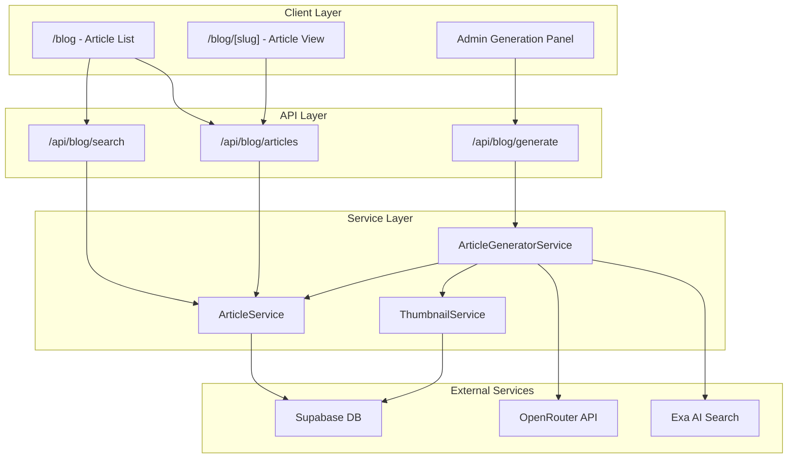
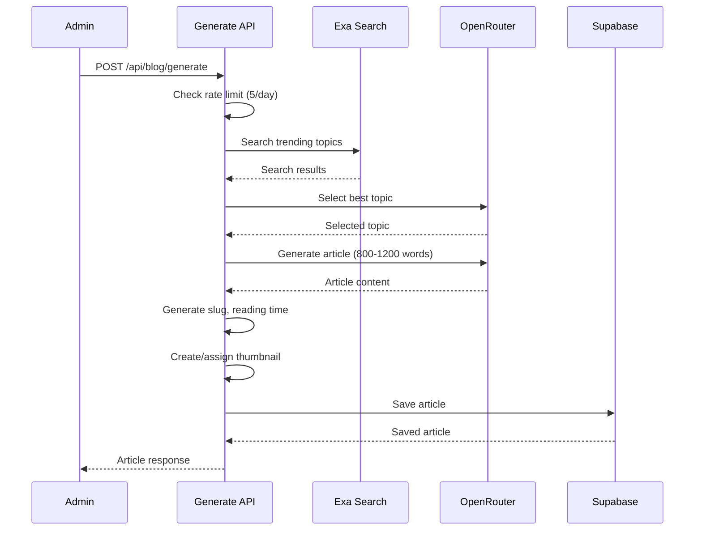

# Design Document: Blog Articles System

## Overview

This document describes the technical design for an AI-powered blog system that automatically generates e-commerce articles using Exa AI for research and OpenRouter for content creation. The system follows a hybrid approach: articles are persisted in Supabase for fast retrieval, with on-demand generation available to admin users.

The design integrates seamlessly with the existing Micro-Tools architecture, reusing established patterns for UI components, database access, and AI tool integration.

## Architecture



## Components and Interfaces

### Database Schema

```sql
-- Articles table
CREATE TABLE articles (
    id UUID PRIMARY KEY DEFAULT gen_random_uuid(),
    slug VARCHAR(255) UNIQUE NOT NULL,
    title VARCHAR(500) NOT NULL,
    summary TEXT NOT NULL,
    content TEXT NOT NULL,
    category VARCHAR(50) NOT NULL,
    tags TEXT[] DEFAULT '{}',
    thumbnail_url TEXT,
    reading_time INTEGER NOT NULL, -- in minutes
    sources JSONB DEFAULT '[]', -- [{url, title, domain}]
    meta_title VARCHAR(70),
    meta_description VARCHAR(160),
    is_published BOOLEAN DEFAULT true,
    created_at TIMESTAMPTZ DEFAULT NOW(),
    updated_at TIMESTAMPTZ DEFAULT NOW()
);

-- Rate limiting table for article generation
CREATE TABLE article_generation_log (
    id UUID PRIMARY KEY DEFAULT gen_random_uuid(),
    admin_id UUID NOT NULL,
    generated_at TIMESTAMPTZ DEFAULT NOW(),
    topic VARCHAR(500),
    success BOOLEAN DEFAULT true
);

-- Indexes for performance
CREATE INDEX idx_articles_category ON articles(category);
CREATE INDEX idx_articles_created_at ON articles(created_at DESC);
CREATE INDEX idx_articles_is_published ON articles(is_published);
CREATE INDEX idx_articles_tags ON articles USING GIN(tags);
CREATE INDEX idx_generation_log_admin_date ON article_generation_log(admin_id, generated_at);
```

### TypeScript Interfaces

```typescript
// Article category enum
export type ArticleCategory = 
  | 'marketing'
  | 'seller-tools'
  | 'logistics'
  | 'trends'
  | 'case-studies';

// Source citation from Exa
export interface ArticleSource {
  url: string;
  title: string;
  domain: string;
}

// Article data model
export interface Article {
  id: string;
  slug: string;
  title: string;
  summary: string;
  content: string;
  category: ArticleCategory;
  tags: string[];
  thumbnailUrl: string | null;
  readingTime: number;
  sources: ArticleSource[];
  metaTitle: string;
  metaDescription: string;
  isPublished: boolean;
  createdAt: Date;
  updatedAt: Date;
}

// Article list item (for cards)
export interface ArticleListItem {
  id: string;
  slug: string;
  title: string;
  summary: string;
  category: ArticleCategory;
  tags: string[];
  thumbnailUrl: string | null;
  readingTime: number;
  createdAt: Date;
}

// Pagination response
export interface PaginatedArticles {
  articles: ArticleListItem[];
  total: number;
  page: number;
  pageSize: number;
  totalPages: number;
}

// Article generation request
export interface GenerateArticleRequest {
  topic?: string; // Optional: let AI choose if not provided
  category?: ArticleCategory;
}

// Exa search result
export interface ExaSearchResult {
  title: string;
  url: string;
  publishedDate: string;
  score: number;
  text: string;
}

// Generation progress status
export type GenerationStatus = 
  | 'searching'      // Searching Exa for topics
  | 'selecting'      // Selecting best topic
  | 'generating'     // Generating article content
  | 'creating-thumbnail' // Creating thumbnail
  | 'saving'         // Saving to database
  | 'complete'       // Done
  | 'error';         // Failed
```

### API Endpoints

```typescript
// GET /api/blog/articles
// Query params: page, pageSize, category, tag, search
interface ListArticlesResponse {
  success: boolean;
  data: PaginatedArticles;
}

// GET /api/blog/articles/[slug]
interface GetArticleResponse {
  success: boolean;
  data: Article;
}

// POST /api/blog/generate (Admin only)
interface GenerateArticleResponse {
  success: boolean;
  data: Article;
  error?: string;
}

// GET /api/blog/categories
interface GetCategoriesResponse {
  success: boolean;
  data: { category: ArticleCategory; count: number }[];
}
```

### Component Structure

```
src/
├── app/[locale]/blog/
│   ├── page.tsx                    # Blog listing page
│   └── [slug]/page.tsx             # Article detail page
├── components/blog/
│   ├── article-card.tsx            # Article preview card
│   ├── article-card-skeleton.tsx   # Loading skeleton
│   ├── article-content.tsx         # Full article renderer
│   ├── article-grid.tsx            # Responsive article grid
│   ├── article-sources.tsx         # Sources section
│   ├── article-share.tsx           # Share buttons
│   ├── category-filter.tsx         # Category filter buttons
│   ├── blog-search.tsx             # Search input
│   ├── blog-hero.tsx               # Hero section
│   ├── blog-pagination.tsx         # Pagination controls
│   └── admin/
│       ├── generate-article-button.tsx
│       └── generation-progress.tsx
├── lib/blog/
│   ├── article-service.ts          # CRUD operations
│   ├── article-generator.ts        # AI generation logic
│   ├── thumbnail-service.ts        # Thumbnail handling
│   ├── slug-generator.ts           # SEO slug creation
│   └── reading-time.ts             # Reading time calculation
└── api/blog/
    ├── articles/route.ts
    ├── articles/[slug]/route.ts
    ├── generate/route.ts
    └── categories/route.ts
```

## Data Models

### Article Generation Flow



### Thumbnail Strategy

```typescript
// Category-based placeholder thumbnails
const CATEGORY_THUMBNAILS: Record<ArticleCategory, string> = {
  'marketing': '/images/blog/marketing-placeholder.svg',
  'seller-tools': '/images/blog/tools-placeholder.svg',
  'logistics': '/images/blog/logistics-placeholder.svg',
  'trends': '/images/blog/trends-placeholder.svg',
  'case-studies': '/images/blog/case-studies-placeholder.svg',
};

// Gradient fallbacks for failed images
const CATEGORY_GRADIENTS: Record<ArticleCategory, string> = {
  'marketing': 'from-purple-500 to-pink-500',
  'seller-tools': 'from-cyan-500 to-blue-500',
  'logistics': 'from-emerald-500 to-teal-500',
  'trends': 'from-orange-500 to-red-500',
  'case-studies': 'from-indigo-500 to-purple-500',
};
```

## Correctness Properties

*A property is a characteristic or behavior that should hold true across all valid executions of a system—essentially, a formal statement about what the system should do. Properties serve as the bridge between human-readable specifications and machine-verifiable correctness guarantees.*

### Property 1: Article Persistence Round-Trip

*For any* valid article data, saving to the database and then retrieving by slug should return an equivalent article with all fields preserved.

**Validates: Requirements 1.1**

### Property 2: Article Listing Order

*For any* set of published articles, the listing endpoint should return them sorted by creation date in descending order (newest first).

**Validates: Requirements 1.2**

### Property 3: Category Filtering Correctness

*For any* category filter applied, all returned articles should have exactly that category, and no articles of other categories should be included.

**Validates: Requirements 1.4, 4.3**

### Property 4: Search Results Relevance

*For any* search query, all returned articles should contain the query string (case-insensitive) in either the title or content fields.

**Validates: Requirements 1.5**

### Property 5: Admin Authorization

*For any* request to the generation endpoint, if the user is not an admin, the request should be rejected with 403 status.

**Validates: Requirements 2.1, 2.2**

### Property 6: Topic Selection Optimality

*For any* set of Exa search results with relevance scores, the selected topic should be the one with the highest combined score (recency + relevance).

**Validates: Requirements 2.4**

### Property 7: Article Word Count Range

*For any* generated article, the content word count should be between 800 and 1200 words (inclusive).

**Validates: Requirements 2.5**

### Property 8: Source Citation Inclusion

*For any* generated article, the sources array should contain at least one URL from the Exa search results used for research.

**Validates: Requirements 2.6, 6.1**

### Property 9: Rate Limiting Enforcement

*For any* admin user, after generating 5 articles in a 24-hour period, subsequent generation requests should be rejected until the window resets.

**Validates: Requirements 2.8**

### Property 10: Thumbnail Assignment

*For any* generated article, the thumbnailUrl field should be non-null (either AI-generated or category placeholder).

**Validates: Requirements 3.1**

### Property 11: Tag Filtering Correctness

*For any* tag filter applied, all returned articles should contain that tag in their tags array.

**Validates: Requirements 4.5**

### Property 12: SEO Metadata Uniqueness

*For any* two distinct articles, their meta titles and meta descriptions should be different.

**Validates: Requirements 5.1**

### Property 13: SEO Metadata Presence

*For any* article page, the HTML should contain valid Open Graph tags (og:title, og:description, og:image) and Article schema JSON-LD.

**Validates: Requirements 5.2, 5.3**

### Property 14: Reading Time Calculation

*For any* article, the reading time should equal ceil(wordCount / 200) minutes, where wordCount is the number of words in the content.

**Validates: Requirements 5.4**

### Property 15: Slug Generation

*For any* article title, the generated slug should be lowercase, contain only alphanumeric characters and hyphens, and be URL-safe.

**Validates: Requirements 5.5**

### Property 16: Source Domain Extraction

*For any* source URL, the displayed domain should be correctly extracted (e.g., "https://www.example.com/path" → "example.com").

**Validates: Requirements 6.3**

### Property 17: Share URL Formatting

*For any* article and share platform (Twitter, LinkedIn), the share URL should contain the correct article URL and pre-filled title.

**Validates: Requirements 9.2**

### Property 18: Ad Placement Intervals

*For any* article listing with N articles where N > 6, ad slots should appear at positions 6, 12, 18, etc. (every 6 articles).

**Validates: Requirements 10.2**

## Error Handling

### Generation Errors

```typescript
type GenerationError = 
  | { code: 'RATE_LIMIT_EXCEEDED'; message: string; resetAt: Date }
  | { code: 'EXA_SEARCH_FAILED'; message: string }
  | { code: 'NO_TOPICS_FOUND'; message: string; suggestions: string[] }
  | { code: 'CONTENT_GENERATION_FAILED'; message: string }
  | { code: 'SAVE_FAILED'; message: string }
  | { code: 'UNAUTHORIZED'; message: string };
```

### Error Recovery Strategies

1. **Exa Search Failure**: Retry with broader search terms, fallback to predefined topic list
2. **OpenRouter Failure**: Use fallback models (same as existing AI tools)
3. **Thumbnail Generation Failure**: Use category placeholder
4. **Database Save Failure**: Return generated content to admin for manual retry

## Testing Strategy

### Unit Tests

- Slug generation from various title formats
- Reading time calculation accuracy
- Domain extraction from URLs
- Category validation
- Rate limit checking logic

### Property-Based Tests

Using fast-check library (already in project):

1. **Article round-trip**: Generate random articles, save, retrieve, compare
2. **Sorting invariant**: Generate random dates, verify ordering
3. **Filter correctness**: Generate random categories/tags, verify filtering
4. **Word count bounds**: Generate articles, verify 800-1200 range
5. **Slug format**: Generate random titles, verify slug format

### Integration Tests

- Full generation flow with mocked Exa/OpenRouter
- Pagination with various page sizes
- Search with special characters
- Admin authorization flow

### Configuration

```typescript
// Property test configuration
const PBT_CONFIG = {
  numRuns: 100,
  seed: Date.now(),
  verbose: true,
};
```
