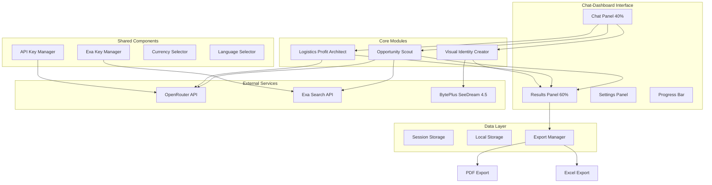

# Design Document: Merchant Assistant System

## Overview

The Merchant Assistant System is an AI-powered platform that guides e-commerce merchants through a complete product launch workflow. The system integrates three specialized modules (Opportunity Scout, Logistics Profit Architect, Visual Identity Creator) into a unified chat-dashboard interface, enabling merchants to discover market opportunities, calculate comprehensive costs, and generate professional product assets through natural conversation.

The architecture follows a modular design with shared components for API key management, currency/language preferences, and a chained agent workflow that orchestrates the three modules sequentially.

## Architecture



## Components and Interfaces

### 1. Chat-Dashboard Component

```typescript
// src/components/merchant-assistant/chat-dashboard.tsx

interface ChatDashboardProps {
  locale: string;
}

interface ChatMessage {
  id: string;
  role: 'user' | 'assistant' | 'system';
  content: string;
  timestamp: Date;
  attachments?: FileAttachment[];
  results?: ModuleResult;
}

interface FileAttachment {
  id: string;
  name: string;
  type: string;
  url: string;
  preview?: string;
}

interface ModuleResult {
  type: 'opportunity' | 'profit' | 'visual' | 'project';
  data: OpportunityResult | ProfitResult | VisualResult | ProjectFile;
  status: 'loading' | 'success' | 'error';
}

interface WorkflowStage {
  id: 'scout' | 'calculate' | 'create';
  label: string;
  status: 'pending' | 'active' | 'completed' | 'error';
  progress: number; // 0-100
}

interface ChatDashboardState {
  messages: ChatMessage[];
  currentStage: WorkflowStage['id'];
  stages: WorkflowStage[];
  focusMode: 'none' | 'chat' | 'dashboard';
  isProcessing: boolean;
  results: {
    opportunity?: OpportunityResult;
    profit?: ProfitResult;
    visual?: VisualResult;
    project?: ProjectFile;
  };
}
```

### 2. API Key Manager Components

```typescript
// src/components/merchant-assistant/exa-key-manager.tsx

interface ExaKeyManagerProps {
  onApiKeyChange?: (apiKey: string | null) => void;
  onValidationChange?: (isValid: boolean) => void;
  compact?: boolean;
}

interface ExaKeyManagerState {
  apiKey: string;
  isValidating: boolean;
  isValid: boolean | null;
  errorMessage: string | null;
  hasStored: boolean;
}

// Validation function
async function validateExaApiKey(apiKey: string): Promise<{
  valid: boolean;
  error?: string;
}>;
```

### 2.1 BytePlus SeeDream Key Manager

```typescript
// src/components/merchant-assistant/seedream-key-manager.tsx

interface SeeDreamKeyManagerProps {
  onApiKeyChange?: (credentials: SeeDreamCredentials | null) => void;
  onValidationChange?: (isValid: boolean) => void;
  compact?: boolean;
}

interface SeeDreamCredentials {
  accessKeyId: string;
  secretAccessKey: string;
}

interface SeeDreamKeyManagerState {
  accessKeyId: string;
  secretAccessKey: string;
  isValidating: boolean;
  isValid: boolean | null;
  errorMessage: string | null;
  hasStored: boolean;
}

// BytePlus SeeDream 4.5 API validation
async function validateSeeDreamCredentials(
  credentials: SeeDreamCredentials
): Promise<{
  valid: boolean;
  error?: string;
  quotaRemaining?: number;
}>;

// Storage keys
const SEEDREAM_ACCESS_KEY_STORAGE = 'seedream-access-key-id';
const SEEDREAM_SECRET_KEY_STORAGE = 'seedream-secret-access-key';
```

### 3. Opportunity Scout Module

```typescript
// src/lib/merchant-assistant/opportunity-scout.ts

interface OpportunitySearchParams {
  category: string;
  keywords?: string[];
  region?: string;
  priceRange?: { min: number; max: number };
}

interface MarketOpportunity {
  id: string;
  productName: string;
  category: string;
  demandIndicators: {
    stockComplaints: number;
    qualityComplaints: number;
    searchVolume: 'high' | 'medium' | 'low';
    trend: 'increasing' | 'stable' | 'decreasing';
  };
  confidenceScore: number; // 0-100
  estimatedMarketSize: 'large' | 'medium' | 'small';
  competitors: number;
  averagePrice: number;
  sources: string[];
}

interface OpportunityResult {
  opportunities: MarketOpportunity[];
  searchQuery: string;
  totalResults: number;
  analysisDate: string;
  suggestions?: string[];
}

async function searchOpportunities(
  exaApiKey: string,
  openRouterApiKey: string,
  params: OpportunitySearchParams,
  options: { locale?: string; currency?: string }
): Promise<OpportunityResult>;
```

### 4. Logistics Profit Architect Module

```typescript
// src/lib/merchant-assistant/logistics-profit-architect.ts

interface ProductCostInput {
  purchasePrice: number;
  quantity: number;
  weight: number; // kg
  dimensions?: { length: number; width: number; height: number }; // cm
  category: string;
  supplierCountry: string;
  destinationCountry: string;
}

interface CostBreakdown {
  purchasePrice: number;
  shippingCost: number;
  customsDuty: number;
  customsDutyRate: number;
  customsDutyUncertain: boolean;
  paymentGatewayFee: number;
  paymentGatewayRate: number;
  vat: number;
  vatRate: number;
  totalLandedCost: number;
  costPerUnit: number;
}

interface ProfitAnalysis {
  breakEvenPrice: number;
  recommendedPrice: number;
  profitMargins: {
    sellingPrice: number;
    profit: number;
    margin: number;
  }[];
}

interface BudgetScenario {
  type: 'conservative' | 'moderate' | 'aggressive';
  quantity: number;
  totalInvestment: number;
  expectedRevenue: number;
  expectedProfit: number;
  roi: number;
  riskLevel: 'low' | 'medium' | 'high';
}

interface ProfitResult {
  costBreakdown: CostBreakdown;
  profitAnalysis: ProfitAnalysis;
  budgetScenarios?: BudgetScenario[];
  warnings: string[];
  currency: string;
}

async function calculateProfit(
  openRouterApiKey: string,
  input: ProductCostInput,
  options: { 
    locale?: string; 
    currency?: string;
    budget?: number;
    targetMargin?: number;
  }
): Promise<ProfitResult>;
```

### 5. Visual Identity Creator Module (BytePlus SeeDream 4.5)

```typescript
// src/lib/merchant-assistant/visual-identity-creator.ts

interface SeeDreamConfig {
  accessKeyId: string;
  secretAccessKey: string;
  region?: string; // default: 'ap-singapore-1'
  serviceVersion?: string; // default: '2024-12-01'
}

interface ImageProcessingInput {
  imageUrls: string[];
  productName: string;
  category: string;
  style?: 'white-background' | 'lifestyle' | 'minimal' | 'premium';
}

interface SeeDreamRequest {
  model: 'seedream-4.5';
  prompt: string;
  image_url?: string; // For image-to-image transformation
  negative_prompt?: string;
  width: number;
  height: number;
  num_images: number;
  guidance_scale: number;
  seed?: number;
}

interface ProcessedImage {
  id: string;
  originalUrl: string;
  processedUrl: string;
  thumbnailUrl: string;
  variant: 'original' | 'white-bg' | 'lifestyle' | 'optimized';
  dimensions: { width: number; height: number };
  fileSize: number;
  format: 'webp' | 'png' | 'jpg';
  seedreamJobId?: string;
}

interface MarketingContent {
  titleAr: string;
  titleEn: string;
  descriptionAr: string;
  descriptionEn: string;
  bulletPointsAr: string[];
  bulletPointsEn: string[];
  seoKeywords: string[];
}

interface VisualResult {
  images: ProcessedImage[];
  marketingContent: MarketingContent;
  processingTime: number;
  seedreamCreditsUsed: number;
  errors?: string[];
}

// BytePlus SeeDream 4.5 API Client
class SeeDreamClient {
  private config: SeeDreamConfig;
  private baseUrl: string;

  constructor(config: SeeDreamConfig) {
    this.config = config;
    this.baseUrl = `https://visual.byteplusapi.com`;
  }

  // Generate image with white background
  async generateWhiteBackground(
    imageUrl: string,
    productName: string
  ): Promise<string>;

  // Generate lifestyle image
  async generateLifestyleImage(
    imageUrl: string,
    productName: string,
    category: string
  ): Promise<string>;

  // Enhance image quality
  async enhanceImage(imageUrl: string): Promise<string>;

  // Remove background
  async removeBackground(imageUrl: string): Promise<string>;

  // Check quota/credits
  async getQuota(): Promise<{ remaining: number; total: number }>;
}

async function processImages(
  seedreamCredentials: SeeDreamCredentials,
  openRouterApiKey: string,
  input: ImageProcessingInput,
  options: { locale?: string; onProgress?: (progress: number) => void }
): Promise<VisualResult>;
```

### 6. Chained Agent Workflow

```typescript
// src/lib/merchant-assistant/chained-workflow.ts

interface WorkflowInput {
  userMessage: string;
  category?: string;
  budget?: number;
  imageUrls?: string[];
}

interface WorkflowContext {
  exaApiKey: string;
  openRouterApiKey: string;
  locale: string;
  currency: string;
  onStageChange: (stage: WorkflowStage['id']) => void;
  onProgress: (stage: WorkflowStage['id'], progress: number) => void;
  onPartialResult: (type: ModuleResult['type'], data: unknown) => void;
}

interface WorkflowResult {
  opportunity?: OpportunityResult;
  profit?: ProfitResult;
  visual?: VisualResult;
  projectFile?: ProjectFile;
  completedStages: WorkflowStage['id'][];
  errors: { stage: WorkflowStage['id']; error: string }[];
}

async function executeWorkflow(
  input: WorkflowInput,
  context: WorkflowContext
): Promise<WorkflowResult>;

// Intent detection to determine which modules to run
async function detectIntent(
  openRouterApiKey: string,
  message: string
): Promise<{
  intent: 'search' | 'calculate' | 'create' | 'full-workflow' | 'question';
  extractedParams: Partial<WorkflowInput>;
}>;
```

### 7. Project File Generator

```typescript
// src/lib/merchant-assistant/project-file-generator.ts

interface ProjectFile {
  id: string;
  createdAt: string;
  title: string;
  summary: {
    category: string;
    budget: number;
    currency: string;
    recommendedProduct: string;
    expectedROI: number;
  };
  opportunity: OpportunityResult;
  profit: ProfitResult;
  visual: VisualResult;
  exportFormats: ('pdf' | 'excel')[];
}

interface ExportOptions {
  format: 'pdf' | 'excel';
  includeImages: boolean;
  language: 'ar' | 'en' | 'both';
}

async function generateProjectFile(
  opportunity: OpportunityResult,
  profit: ProfitResult,
  visual: VisualResult,
  options: { locale: string; currency: string }
): Promise<ProjectFile>;

async function exportProject(
  project: ProjectFile,
  options: ExportOptions
): Promise<Blob>;
```

## Data Models

### Session State Model

```typescript
interface MerchantAssistantSession {
  id: string;
  createdAt: Date;
  updatedAt: Date;
  messages: ChatMessage[];
  currentWorkflow: {
    stage: WorkflowStage['id'] | null;
    input: WorkflowInput | null;
    results: Partial<WorkflowResult>;
  };
  preferences: {
    currency: string;
    responseLanguage: string;
  };
  apiKeys: {
    openRouterValid: boolean;
    exaValid: boolean;
  };
}
```

### Cost Calculation Constants

```typescript
// src/lib/merchant-assistant/constants.ts

const SHIPPING_RATES = {
  china_saudi: {
    air: { baseRate: 25, perKg: 8 },
    sea: { baseRate: 50, perCbm: 150 },
    express: { baseRate: 40, perKg: 15 },
  },
  // Add more routes as needed
};

const CUSTOMS_DUTY_RATES = {
  electronics: 0.05,
  clothing: 0.12,
  cosmetics: 0.15,
  food: 0.10,
  general: 0.05,
  // Default rate when category unknown
  unknown: 0.10,
};

const PAYMENT_GATEWAY_FEES = {
  mada: { percentage: 0.018, fixed: 0 },
  visa: { percentage: 0.025, fixed: 0.5 },
  mastercard: { percentage: 0.025, fixed: 0.5 },
  applepay: { percentage: 0.02, fixed: 0 },
  stcpay: { percentage: 0.02, fixed: 0 },
  tabby: { percentage: 0.05, fixed: 0 },
};

const VAT_RATES = {
  saudi_arabia: 0.15,
  uae: 0.05,
  egypt: 0.14,
  // Add more countries
};
```

## Correctness Properties

*A property is a characteristic or behavior that should hold true across all valid executions of a system—essentially, a formal statement about what the system should do. Properties serve as the bridge between human-readable specifications and machine-verifiable correctness guarantees.*

### Property 1: Cost Calculation Accuracy
*For any* product cost input with valid numeric values, the total landed cost SHALL equal the sum of (purchase price + shipping cost + customs duty + payment gateway fee + VAT), with no more than 0.01 currency unit rounding error.
**Validates: Requirements 4.1, 4.2, 4.3, 4.4, 4.5, 4.6**

### Property 2: Breakeven Price Validity
*For any* cost breakdown, the breakeven price SHALL be greater than or equal to the cost per unit, ensuring no loss scenario.
**Validates: Requirements 4.7**

### Property 3: Budget Scenario Consistency
*For any* budget and product cost, the calculated quantity in each scenario SHALL not exceed (budget / cost per unit), and total investment SHALL not exceed the specified budget.
**Validates: Requirements 8.1, 8.2, 8.3**

### Property 4: ROI Calculation Correctness
*For any* budget scenario, the ROI SHALL equal ((expected profit / total investment) * 100), with consistent values across conservative, moderate, and aggressive scenarios.
**Validates: Requirements 8.5**

### Property 5: Opportunity Ranking Consistency
*For any* set of market opportunities, they SHALL be sorted by confidence score in descending order, with each opportunity having a confidence score between 0 and 100.
**Validates: Requirements 3.3, 3.6, 3.8**

### Property 6: Workflow Stage Progression
*For any* chained workflow execution, stages SHALL progress in order (scout → calculate → create), and a stage SHALL not start until the previous stage completes or is skipped.
**Validates: Requirements 6.2, 6.3, 6.4**

### Property 7: API Key Validation Idempotence
*For any* valid API key (OpenRouter, Exa, or SeeDream), validating it multiple times SHALL return the same result (valid: true), demonstrating idempotent validation behavior.
**Validates: Requirements 2.2, 2.6, 2.10**

### Property 8: Currency Formatting Round-Trip
*For any* numeric amount and currency code, formatting then parsing SHALL return a value within 0.01 of the original amount (round-trip property).
**Validates: Requirements 2.12, 2.16**

### Property 9: Session State Persistence
*For any* session with messages, saving to storage then loading SHALL return an equivalent session object with all messages preserved.
**Validates: Requirements 1.7**

### Property 10: Export Content Completeness
*For any* project file with all three module results, the exported PDF/Excel SHALL contain supplier information, cost breakdown, breakeven analysis, and image links.
**Validates: Requirements 7.1, 7.2, 7.3, 7.4, 7.7**

### Property 11: Response Language Matching
*For any* user query in a specific language (Arabic or English), the Merchant_Assistant response SHALL be in the same language as the query.
**Validates: Requirements 9.2**

### Property 12: Bilingual Marketing Content
*For any* processed product through Visual_Identity_Creator, the marketing content SHALL contain both Arabic (titleAr, descriptionAr) and English (titleEn, descriptionEn) versions.
**Validates: Requirements 9.3, 7.5**

### Property 13: Image Processing Completeness
*For any* batch of input images, the Visual_Identity_Creator SHALL process all images and return a ProcessedImage for each input, with valid URLs for processed versions.
**Validates: Requirements 5.5, 5.6, 5.8**

### Property 14: File Type Validation
*For any* dropped file in the Chat_Dashboard, the system SHALL validate the file type and only accept image formats (jpg, png, webp, gif).
**Validates: Requirements 1.14**

### Property 15: Progress Bar State Consistency
*For any* workflow state, the Progress_Bar SHALL accurately reflect the current stage and completion percentage, with completed stages showing 100% and pending stages showing 0%.
**Validates: Requirements 1.12**

## Error Handling

### API Error Handling

```typescript
interface MerchantAssistantError {
  code: 
    | 'INVALID_OPENROUTER_KEY'
    | 'INVALID_EXA_KEY'
    | 'INVALID_SEEDREAM_CREDENTIALS'
    | 'INSUFFICIENT_CREDITS'
    | 'SEEDREAM_QUOTA_EXCEEDED'
    | 'RATE_LIMIT'
    | 'NETWORK_ERROR'
    | 'SEARCH_FAILED'
    | 'CALCULATION_ERROR'
    | 'IMAGE_PROCESSING_FAILED'
    | 'EXPORT_FAILED';
  message: string;
  stage?: WorkflowStage['id'];
  retryable: boolean;
  userMessage: {
    ar: string;
    en: string;
  };
}

const ERROR_MESSAGES: Record<MerchantAssistantError['code'], MerchantAssistantError['userMessage']> = {
  INVALID_OPENROUTER_KEY: {
    ar: 'مفتاح OpenRouter غير صالح. يرجى التحقق من المفتاح.',
    en: 'Invalid OpenRouter API key. Please verify your key.',
  },
  INVALID_EXA_KEY: {
    ar: 'مفتاح Exa غير صالح. يرجى التحقق من المفتاح.',
    en: 'Invalid Exa API key. Please verify your key.',
  },
  INVALID_SEEDREAM_CREDENTIALS: {
    ar: 'بيانات اعتماد SeeDream غير صالحة. يرجى التحقق من Access Key ID و Secret Access Key.',
    en: 'Invalid SeeDream credentials. Please verify your Access Key ID and Secret Access Key.',
  },
  INSUFFICIENT_CREDITS: {
    ar: 'رصيد API غير كافٍ. يرجى شحن حسابك.',
    en: 'Insufficient API credits. Please top up your account.',
  },
  SEEDREAM_QUOTA_EXCEEDED: {
    ar: 'تم استنفاد حصة SeeDream. يرجى شحن حسابك في BytePlus.',
    en: 'SeeDream quota exceeded. Please top up your BytePlus account.',
  },
  RATE_LIMIT: {
    ar: 'تم تجاوز حد الطلبات. يرجى الانتظار قليلاً.',
    en: 'Rate limit exceeded. Please wait a moment.',
  },
  NETWORK_ERROR: {
    ar: 'خطأ في الاتصال. يرجى التحقق من اتصالك بالإنترنت.',
    en: 'Network error. Please check your internet connection.',
  },
  SEARCH_FAILED: {
    ar: 'فشل البحث عن الفرص. يرجى المحاولة مرة أخرى.',
    en: 'Opportunity search failed. Please try again.',
  },
  CALCULATION_ERROR: {
    ar: 'خطأ في الحسابات. يرجى التحقق من البيانات المدخلة.',
    en: 'Calculation error. Please verify your input data.',
  },
  IMAGE_PROCESSING_FAILED: {
    ar: 'فشل معالجة الصور بواسطة SeeDream. يرجى التحقق من روابط الصور.',
    en: 'SeeDream image processing failed. Please verify image URLs.',
  },
  EXPORT_FAILED: {
    ar: 'فشل تصدير الملف. يرجى المحاولة مرة أخرى.',
    en: 'Export failed. Please try again.',
  },
};
```

### Graceful Degradation

```typescript
// When a module fails, continue with partial results
async function executeWorkflowWithFallback(
  input: WorkflowInput,
  context: WorkflowContext
): Promise<WorkflowResult> {
  const result: WorkflowResult = {
    completedStages: [],
    errors: [],
  };

  // Stage 1: Opportunity Scout
  try {
    result.opportunity = await searchOpportunities(/* ... */);
    result.completedStages.push('scout');
  } catch (error) {
    result.errors.push({ stage: 'scout', error: error.message });
    // Continue to next stage if user provided product details
    if (!input.category) {
      return result; // Cannot continue without category
    }
  }

  // Stage 2: Profit Calculation
  try {
    result.profit = await calculateProfit(/* ... */);
    result.completedStages.push('calculate');
  } catch (error) {
    result.errors.push({ stage: 'calculate', error: error.message });
    // Continue to visual if images provided
  }

  // Stage 3: Visual Identity
  if (input.imageUrls?.length) {
    try {
      result.visual = await processImages(/* ... */);
      result.completedStages.push('create');
    } catch (error) {
      result.errors.push({ stage: 'create', error: error.message });
    }
  }

  // Generate project file with available results
  if (result.completedStages.length > 0) {
    result.projectFile = await generateProjectFile(/* ... */);
  }

  return result;
}
```

## Testing Strategy

### Unit Tests

Unit tests verify specific examples and edge cases:

1. **Cost Calculation Tests**
   - Test with known input/output pairs
   - Test edge cases (zero values, very large numbers)
   - Test currency conversion accuracy

2. **API Key Validation Tests**
   - Test valid key format detection (OpenRouter, Exa, SeeDream)
   - Test invalid key rejection
   - Test network error handling

3. **Workflow Stage Tests**
   - Test stage transitions
   - Test partial completion scenarios
   - Test error recovery

4. **SeeDream Integration Tests**
   - Test credential validation
   - Test image processing request/response
   - Test quota checking

### Property-Based Tests

Property tests verify universal properties across all inputs using fast-check:

1. **Property 1: Cost Calculation Accuracy**
   - Generate random valid cost inputs
   - Verify sum equals total with tolerance

2. **Property 2: Breakeven Price Validity**
   - Generate random cost breakdowns
   - Verify breakeven >= cost per unit

3. **Property 3: Budget Scenario Consistency**
   - Generate random budgets and costs
   - Verify quantity * cost <= budget

4. **Property 4: ROI Calculation Correctness**
   - Generate random scenarios
   - Verify ROI formula correctness

5. **Property 5: Opportunity Ranking Consistency**
   - Generate random opportunity lists
   - Verify sorted by confidence score descending

6. **Property 6: Workflow Stage Progression**
   - Generate random workflow executions
   - Verify stage order is maintained

7. **Property 7: API Key Validation Idempotence**
   - Generate valid API keys
   - Verify multiple validations return same result

8. **Property 8: Currency Formatting Round-Trip**
   - Generate random amounts and currencies
   - Verify format → parse ≈ original

9. **Property 9: Session State Persistence**
   - Generate random session states
   - Verify save → load preserves data

10. **Property 10: Export Content Completeness**
    - Generate random project files
    - Verify all required sections present

11. **Property 11: Response Language Matching**
    - Generate queries in different languages
    - Verify response language matches input

12. **Property 12: Bilingual Marketing Content**
    - Generate random products
    - Verify both Arabic and English content present

13. **Property 13: Image Processing Completeness**
    - Generate random image batches
    - Verify all images processed with valid URLs

14. **Property 14: File Type Validation**
    - Generate random file types
    - Verify only valid image types accepted

15. **Property 15: Progress Bar State Consistency**
    - Generate random workflow states
    - Verify progress bar reflects state accurately

### Integration Tests

1. **Full Workflow Test**
   - Test complete scout → calculate → create flow
   - Verify data passes correctly between stages

2. **Export Test**
   - Test PDF generation with all data
   - Test Excel generation with all data

3. **SeeDream API Test**
   - Test image enhancement flow
   - Test background removal flow
   - Test batch processing

### Test Configuration

```typescript
// jest.config.js additions
{
  testMatch: [
    '**/merchant-assistant/**/*.test.ts',
    '**/merchant-assistant/**/*.property.test.ts',
  ],
  setupFilesAfterEnv: ['./src/lib/merchant-assistant/__tests__/setup.ts'],
}

// Property test configuration
const FC_CONFIG = {
  numRuns: 100,
  seed: Date.now(),
  verbose: true,
};
```
